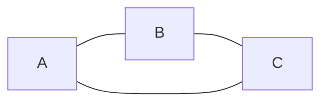
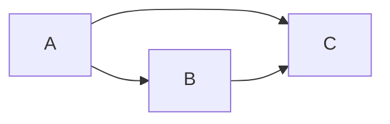
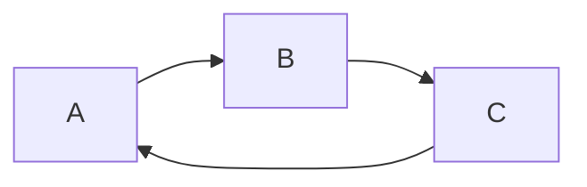
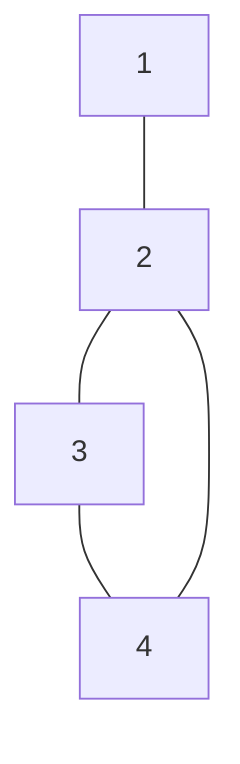
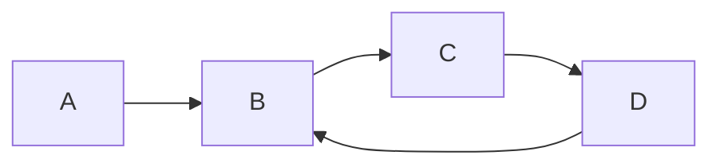
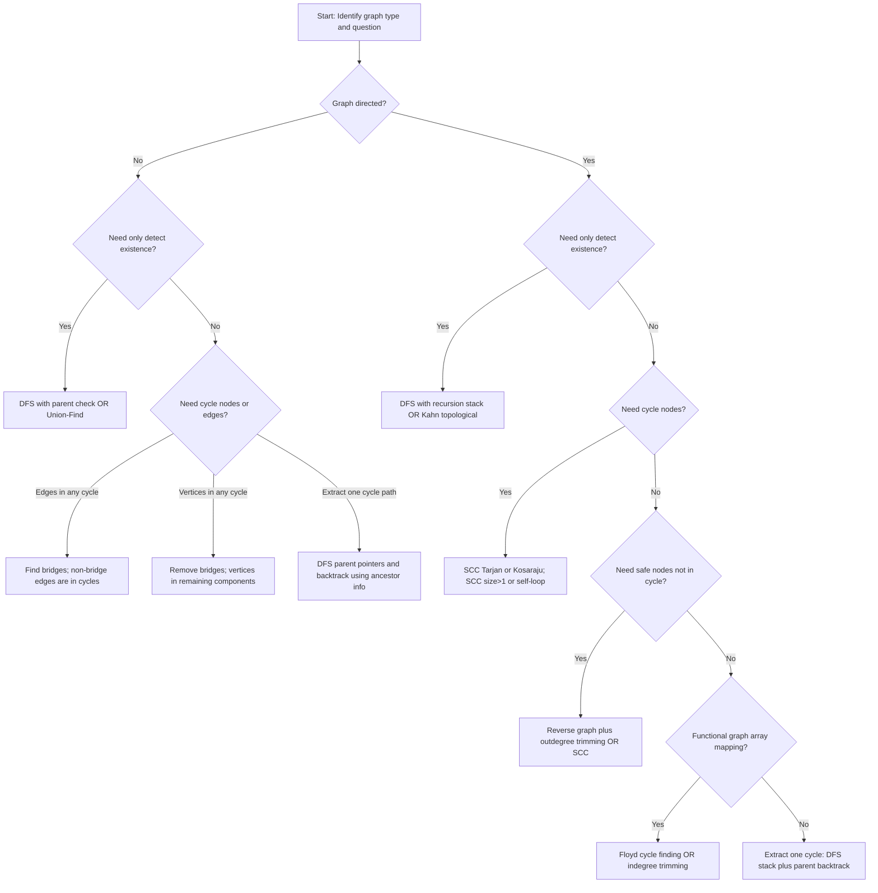

# Cycles in Graphs — Complete Mastery Notes

## 1. Graph Fundamentals (Cycle-focused)

### 1.1 Formal definition of a cycle

Let (G = (V, E)).

**Undirected graph.** A **cycle** is a sequence of vertices ((v_0, v_1, \dots, v_k)) such that:

* (k \ge 2)
* (v_0 = v_k)
* ({v_{i-1}, v_i} \in E) for all (i \in [1, k])
* Vertices (v_0, v_1, \dots, v_{k-1}) are distinct (for a **simple cycle**)

If distinctness is not required, the cycle may revisit vertices/edges and becomes a **closed walk**.

**Directed graph.** A **directed cycle** is a sequence ((v_0, v_1, \dots, v_k)) such that:

* (k \ge 1)
* (v_0 = v_k)
* ((v_{i-1}, v_i) \in E) for all (i \in [1, k])
* For a **simple directed cycle**, (v_0, \dots, v_{k-1}) are distinct.

### 1.2 Distinctions: simple cycle, back edge, self-loop, multi-cycle graphs

#### Simple cycle

A cycle with no repeated vertices other than the start/end.

* Undirected: length (\ge 3) for a simple cycle in simple graphs (no multi-edges, no self-loops).
* Directed: length (\ge 2) for a simple cycle if no self-loops; length (1) is possible if self-loops exist.

#### Self-loop

An edge from a vertex to itself.

* Undirected: an edge ({v, v}) (rare in typical interview constraints).
* Directed: an edge ((v, v)) forms a cycle of length (1).

Self-loops are cycles by definition (closed walk length (1)); many algorithms need explicit handling because typical “parent” logic assumes length (\ge 2).

#### Back edge

A concept defined relative to a **DFS tree**.

* **Directed graph DFS:** an edge ((u \to v)) where (v) is an ancestor of (u) in the current DFS recursion stack. Back edges **are equivalent** to the existence of a directed cycle reachable from that DFS root.
* **Undirected graph DFS:** the notion differs because every undirected edge is seen twice; an edge to an already visited vertex is not necessarily a cycle witness unless it is not the immediate parent edge.

#### Multi-cycle graphs

Graphs may contain multiple cycles which:

* share vertices (overlapping cycles),
* share edges,
* or be disjoint components.

Cycle problems become structurally harder when the question asks for:

* all cycles,
* all nodes in any cycle,
* minimum removals,
* or global constraints (feedback sets).

### 1.3 Why cycle problems differ from traversal problems

Traversal problems (reachability, distances, connectivity) generally depend on **tree-like exploration** and monotonic properties (visited states, levels, shortest paths).

Cycle problems require reasoning about **non-tree edges** and **global structure**:

* A DFS tree itself is acyclic; cycles exist only via edges that violate tree structure.
* In directed graphs, directionality makes “visited” insufficient; the critical concept is “currently active path” (recursion stack).
* Many cycle questions require identifying **subgraphs** with closure properties (SCCs, biconnected components), not just discovering nodes.

Key consequence:

* The same exploration order can be correct for reachability but incorrect for cycle detection if state is incomplete.
* Many cycle tasks are not about finding a path, but about identifying edges/vertices that participate in at least one closed structure.

---

## 2. Directed vs Undirected Graphs (CRITICAL SECTION)

### 2.1 Structural differences

* **Undirected cycles** depend only on adjacency; reversing traversal does not change feasibility.
* **Directed cycles** require directional consistency; strong structural asymmetry exists.

**Fundamental equivalences**

* Undirected: a connected component contains a cycle iff (|E| \ge |V|) (for simple undirected graphs without multi-edges/self-loops).
* Directed: no analogous simple count condition implies a directed cycle; direction matters.

### 2.2 Why the same logic does not apply

#### What breaks if undirected parent-DFS logic is reused in directed graphs

Undirected DFS cycle detection uses: “visited neighbor that is not parent implies cycle.”
In directed graphs, an edge to a visited node does **not** imply a cycle; it could be a forward or cross edge to a completed subtree.

In directed graphs, only an edge to a node **on the current recursion stack** implies a directed cycle.

#### What breaks if directed recursion-stack logic is reused in undirected graphs

In undirected graphs, because each edge appears in both directions, the parent edge will always appear as an edge to an active ancestor, causing false positives unless the parent is explicitly excluded.

### 2.3 Comparison table

| Aspect                   | Undirected Graphs                                      | Directed Graphs                                                       |
| ------------------------ | ------------------------------------------------------ | --------------------------------------------------------------------- |
| Cycle witness in DFS     | Edge to visited vertex not equal to parent             | Back edge to vertex in recursion stack                                |
| Primary detection state  | `visited[]` + `parent`                                 | `state[]` with 0/1/2 or `visited[]` + `inStack[]`                     |
| Typical linear detection | DFS-parent, Union-Find                                 | DFS-recursion-stack, Kahn topo                                        |
| Extraction ease          | Often straightforward with parent pointers             | Requires stack/parent tracking; careful with cross edges              |
| Removal to make acyclic  | Remove edges to form a spanning tree/forest (MST-like) | Minimum feedback edge/vertex set is hard; heuristics or special cases |
| “All nodes in cycles”    | Via bridges / biconnected components                   | Via SCCs; nodes in SCC of size>1 or self-loop                         |
| Enumerate all cycles     | Exponential; not efficient generally                   | Exponential; not efficient generally                                  |

### 2.4 Same structure behaving differently: Mermaid diagrams

#### Same undirected adjacency, different directed orientation



Undirected triangle: cycle exists.

Now direct edges in an acyclic orientation:



This is a DAG (no directed cycle) even though the underlying undirected graph has a cycle.

Now direct edges to form a directed cycle:



Directed cycle exists.

---

## 3. Cycle Detection Algorithms (With When-to-Use Rules)

### 3.0 Selection rules (high-level)

* **Undirected + edge list, need only existence:** DFS-parent or Union-Find.
* **Directed + need only existence:** DFS recursion-stack or Kahn topological sort.
* **Directed + need “nodes eventually safe / not in cycle”:** reverse graph + outdegree trimming or SCC-based.
* **Functional graph / array mapping:** Floyd (tortoise-hare) or indegree trimming.
* **Need cycle path:** DFS with parent tracking (undirected), DFS with parent+stack (directed).
* **Streaming edges / online:** Union-Find for undirected cycle detection.

---

### 3.1 DFS + Parent (Undirected)

#### Intuition

A DFS tree is acyclic. In an undirected graph, encountering an already visited vertex that is **not** the parent implies an alternate connection creating a cycle.

#### Pseudocode

```text
DFS(u, parent):
  visited[u] = true
  for v in adj[u]:
    if not visited[v]:
       parentOf[v] = u
       if DFS(v, u) == true: return true
    else if v != parent:
       // found a cycle edge (u - v)
       return true
  return false

For each node not visited:
  if DFS(node, -1) == true: cycle exists
```

#### Time & space

* Time: (O(V + E))
* Space: (O(V)) for recursion + arrays

#### What it can find

* Existence of at least one cycle in an undirected graph.
* With parent pointers, can extract a cycle when a non-parent visited neighbor is found.

#### What it can never find

* Does not enumerate all cycles efficiently.
* Does not directly mark all nodes in any cycle without additional logic (needs bridges/biconnected components).

#### Common mistakes

* Forgetting `v != parent` check → false cycle detection.
* Mis-handling multi-edges: parallel edges between the same two vertices create a cycle of length 2 (in multigraph). Standard “parent check” may miss or mis-handle unless edges are treated with IDs.
* Self-loops: a self-loop should be treated as immediate cycle; DFS-parent logic may not catch unless explicitly checked.

---

### 3.2 DFS + Recursion Stack (Directed)

#### Intuition

A directed cycle exists iff during DFS you discover an edge to a node currently on the DFS recursion stack (a back edge).

Use 3-state coloring:

* 0 = unvisited
* 1 = visiting (in current stack)
* 2 = exited (fully processed)

#### Pseudocode

```text
DFS(u):
  state[u] = 1  // visiting
  for v in adj[u]:
    if state[v] == 0:
       parentOf[v] = u
       if DFS(v) == true: return true
    else if state[v] == 1:
       // back edge u -> v
       return true
  state[u] = 2  // exited
  return false

For each node:
  if state[node] == 0:
     if DFS(node) == true: cycle exists
```

#### Time & space

* Time: (O(V + E))
* Space: (O(V))

#### What it can find

* Existence of a directed cycle.
* Can extract one directed cycle using parent pointers when encountering a back edge.

#### What it can never find

* Cannot detect cycles using only `visited[]`; must track recursion stack.
* Does not directly compute all nodes in any cycle (SCC or other approach needed).

#### Common mistakes

* Using `visited[]` alone → false positives or false negatives.
* Not marking exited nodes → repeated work or incorrect recursion-stack interpretation.
* Confusing cross edges (to `state=2`) with back edges.

---

### 3.3 BFS-based detection (when applicable)

#### Undirected graphs

A pure BFS analogue exists: if during BFS you see an already visited neighbor that is not the parent, there is a cycle. Similar caveats as DFS.

#### Directed graphs

BFS-based cycle detection is typically done via **topological sorting (Kahn)**, not via parent logic.

##### Undirected BFS pseudocode

```text
Queue-based BFS from start:
  visited[start] = true
  parent[start] = -1
  while q not empty:
    u = pop
    for v in adj[u]:
      if not visited[v]:
         visited[v] = true
         parent[v] = u
         push v
      else if v != parent[u]:
         return true
return false
```

##### When to use

* When recursion depth is risky (stack overflow) and iterative is preferred.
* When graph is large and iterative approach is safer.

##### Common mistakes

* Same as DFS: forgetting parent check.
* Treating directed edges with this logic is incorrect.

---

### 3.4 Union-Find (Disjoint Set Union) — Undirected

#### Intuition

In an undirected graph processed edge-by-edge, if an edge connects two vertices already in the same connected component, it closes a cycle.

#### Pseudocode

```text
MakeSet(0..n-1)
for each edge (u, v):
  if Find(u) == Find(v):
     return true  // cycle exists
  Union(u, v)
return false
```

#### Time & space

* Time: (O(E \cdot \alpha(V))) (inverse Ackermann, effectively constant)
* Space: (O(V))

#### What it can find

* Existence of at least one cycle in an undirected graph.
* The first edge that creates a cycle under the chosen processing order.

#### What it can never find

* It cannot reconstruct the exact cycle path without additional data structures.
* It cannot handle directed cycles (DSU ignores direction).
* It cannot find all cycle edges/vertices.

#### Common mistakes

* Using it for directed graphs (incorrect).
* Assuming the “cycle edge” returned uniquely identifies the cycle (it depends on edge order).
* Misinterpreting for multigraphs: parallel edges are cycle of length 2; DSU will detect on second parallel edge (correct), but extraction still not possible.

---

### 3.5 Topological Sort (Kahn’s Algorithm) — Directed

#### Intuition

A directed graph has a cycle iff it is **not** a DAG. Kahn’s algorithm removes nodes with indegree 0 iteratively. If nodes remain unremoved, they must be in (or depend on) a cycle.

#### Pseudocode

```text
Compute indegree[u] for all u
q = all nodes with indegree 0
count = 0
while q not empty:
  u = pop
  count++
  for v in adj[u]:
    indegree[v]--
    if indegree[v] == 0:
      push v
if count != V:
  cycle exists
else:
  no cycle
```

#### Time & space

* Time: (O(V + E))
* Space: (O(V))

#### What it can find

* Detects existence of directed cycles.
* Produces a topological ordering if acyclic.

#### What it can never find

* Does not directly extract a cycle path.
* Remaining nodes after Kahn are not guaranteed to be exactly “cycle nodes” in general directed graphs; they are nodes not removable by indegree-0 elimination (which includes all nodes in cycles and nodes that are only reachable from cycles with no incoming from outside removed set). For “cycle membership,” SCC approach is precise.

#### Common mistakes

* Claiming leftover nodes are “exactly cycle nodes” without qualification.
* Forgetting to initialize queue with all indegree 0 nodes (must include disconnected components).
* Not using long/int types for large graphs is usually fine; indegree fits in int.

---

### 3.6 Floyd’s Cycle Detection (Tortoise-Hare) — Functional Graphs

#### Functional graph definition

A directed graph where every node has outdegree exactly 1 (or outdegree 0/1 in some variants), e.g. array mapping (f(i)).

Functional graphs decompose into:

* directed cycles,
* trees feeding into those cycles.

#### Intuition

Two pointers moving at different speeds must meet inside the cycle if one exists in the reachable component.

#### Pseudocode

```text
tortoise = f(start)
hare = f(f(start))
while tortoise != hare:
  tortoise = f(tortoise)
  hare = f(f(hare))

// find entry
tortoise = start
while tortoise != hare:
  tortoise = f(tortoise)
  hare = f(hare)
entry = tortoise
```

#### Time & space

* Time: (O(\mu + \lambda)) where (\mu) is tail length, (\lambda) cycle length
* Space: (O(1))

#### What it can find

* Detect a cycle reachable from `start`.
* Find the cycle entry point.
* With extra steps, compute cycle length.

#### What it can never find

* Not applicable for general graphs with branching outdegree.
* Does not identify all cycles in a functional graph unless applied per component with additional bookkeeping.
* In arrays with values out of range, the function (f) may be undefined; constraints must ensure mapping is valid.

#### Common mistakes

* Using Floyd in general graphs (incorrect).
* Forgetting that detection is only for the reachable portion from `start`.
* In problems like duplicate number (LeetCode 287), the “graph” is on indices, and mapping must be defined exactly as specified.

---

## 4. Cycle Extraction (Edges & Vertices)

### 4.1 Extracting one cycle in undirected graph (DFS parent backtracking)

When DFS finds an edge ((u, v)) where `visited[v]=true` and (v \ne parent[u]), the edge connects (u) to an ancestor (in undirected DFS, it is an ancestor in the current DFS tree in standard implementations). The cycle is the path (u \to ... \to v) in the parent tree plus edge ((u, v)).

#### Algorithm (conceptual)

* Maintain `parentOf[]`.
* When cycle edge ((u, v)) found, backtrack from (u) via parents until reaching (v), collecting vertices; then add (v) to close.

#### Pseudocode

```text
on finding cycle edge (u, v):
  cycle = []
  x = u
  cycle.append(x)
  while x != v:
    x = parentOf[x]
    cycle.append(x)
  cycle.append(u) // optional to show closure
```

**Caveat:** In undirected DFS, “visited neighbor not parent” could be:

* an ancestor in recursion (common),
* or a previously visited node in a different branch (depending on implementation).
  To ensure correctness, extraction typically relies on discovering `v` that is currently in recursion path. One robust method: maintain an `inStack[]` even in undirected extraction, or use timestamps to ensure ancestor relation.

### 4.2 Extracting one cycle in directed graph (back edge to recursion stack)

When DFS encounters ((u \to v)) with `state[v]=1`, (v) is in the current recursion path. The cycle is the path from (v) down to (u) in the parent chain, plus edge ((u \to v)).

#### Pseudocode

```text
on back edge u -> v where state[v]==1:
  cycle = []
  x = u
  cycle.append(x)
  while x != v:
    x = parentOf[x]
    cycle.append(x)
  cycle.reverse()  // now v ... u
  cycle.append(v)  // close the cycle
```

### 4.3 Extracting cycle edges

If cycle vertices are (v_0, v_1, \dots, v_k=v_0), cycle edges are ((v_i, v_{i+1})) for directed, or ({v_i, v_{i+1}}) for undirected.

### 4.4 Why some algorithms cannot reconstruct cycles

* **Union-Find:** Only maintains component membership, not the internal structure/path. Reconstructing requires additional graph info (e.g., store a spanning forest and do LCA/path queries), which defeats the simplicity.
* **Kahn’s algorithm:** Produces an elimination order, but does not preserve the specific back edge responsible for cycle. The remaining subgraph contains cycles, but extracting an explicit cycle requires additional DFS on the remaining nodes.

### 4.5 Example diagrams

#### Undirected extraction example



Cycle: 2-3-4-2. If DFS visits 2→3→4 then sees edge 4—2 (visited, not parent), cycle is path 4→3→2 plus edge (4—2).

#### Directed extraction example



Back edge (D \to B) gives cycle (B \to C \to D \to B).

---

## 5. All Nodes That Belong to Any Cycle

### 5.1 Why this is harder than detecting a single cycle

Detecting existence is a local witness problem (one back edge or one DSU conflict).
Determining all cycle nodes is a **global membership** problem:

* A node may be on a cycle even if it is not on the first found cycle.
* In directed graphs, cycle membership depends on mutual reachability (SCC).
* In undirected graphs, membership depends on whether edges are part of some cycle (non-bridge structure).

---

### 5.2 Directed graphs: SCCs (Tarjan / Kosaraju)

#### Key theorem

A vertex belongs to a directed cycle iff it is in a strongly connected component (SCC) of:

* size (\ge 2), or
* size (=1) with a self-loop.

Reason: In SCC, every node can reach every other. In particular, node can reach itself via nontrivial path (cycle) if SCC size ≥ 2; or via self-loop.

#### Tarjan (overview)

Tarjan computes SCCs in one DFS using lowlink values.

**Cycle nodes identification**

* Run SCC decomposition.
* Mark all vertices in SCC size ≥ 2 as “in some cycle”.
* Additionally, for singleton SCC ({v}), if there exists edge (v \to v), mark it.

#### Kosaraju (overview)

* DFS order on original graph.
* DFS on reversed graph in decreasing finish time to form SCCs.

**Complexities**

* Both: (O(V+E)) time, (O(V)) space.

---

### 5.3 Undirected graphs: bridges and biconnected components

#### Bridge definition

An undirected edge (e) is a **bridge** if removing it increases the number of connected components.

#### Fundamental fact (inverse thinking)

An undirected edge belongs to **some** cycle **iff it is not a bridge**.

**Proof sketch**

* If edge (e) lies on a cycle, removing (e) still leaves an alternate path between its endpoints via the rest of the cycle → connectivity unchanged → not a bridge.
* If (e) is not a bridge, endpoints remain connected after removing (e), implying an alternative path between endpoints → together with (e) forms a cycle containing (e).

#### Implication: nodes in any cycle

A node belongs to at least one cycle iff it is incident to at least one **non-bridge** edge and lies within a 2-edge-connected structure. Practically:

* Compute all bridges using Tarjan-style low/tin.
* Remove bridges; remaining edges form components where every edge is in some cycle.
* Any vertex that lies in a component with at least one edge after removing bridges is part of some cycle (careful: isolated vertices after bridge removal are not).

#### Biconnected components (articulation-related)

For **vertex** membership in cycles in the presence of articulation points:

* A vertex can be in cycles even if it is an articulation point.
* Biconnected components (2-vertex-connected) characterize where simple cycles exist without single-vertex separation.
  For many interview tasks, bridges (2-edge-connected) suffice when asked “edges/nodes in cycles”.

---

## 6. Removing Cycles

### 6.1 Removing a single cycle

Depends on graph type and requirement:

* If only need to “break a cycle,” removing **any one edge** on that cycle makes that particular cycle disappear.
* But graph may still contain other cycles.

**Directed single cycle break**

* If you have extracted a cycle path, remove one edge on it (problem-specific constraints may restrict which edges can be removed).

**Undirected single cycle break**

* Remove any edge on the extracted cycle.

### 6.2 Removing all cycles (making graph acyclic)

#### Undirected graphs: make a forest

To make an undirected graph acyclic, choose a **spanning forest** of each component:

* Keep (V - c) edges where (c) is number of connected components.
* Remove the rest. Any spanning tree is acyclic.

This is structurally aligned with MST:

* Any spanning tree breaks all cycles.
* If weighted and want minimum total removed weight or minimum kept weight, this becomes MST-related (keep MST edges).

**Key point:** In undirected graphs, making acyclic is easy; optimal edge removals under simple objectives often reduce to spanning tree problems.

#### Directed graphs: make a DAG

Removing edges to make a directed graph acyclic relates to **feedback edge set** (FES) / **feedback vertex set** (FVS).

* Finding a minimum feedback edge set in directed graphs is NP-hard in general (see Section 7).
* Practical approaches: heuristics, approximation, or exploit constraints (tournaments, small n, special structure).

### 6.3 “Remove minimum edges” is non-trivial

* Undirected unweighted: minimum edges to remove to make acyclic is (E - (V - c)) (keep spanning forest). This is trivial.
* Directed: minimum edges to remove to make acyclic has no simple formula; depends on cycle interdependencies.

### 6.4 Relationship to Minimum Spanning Tree and Feedback Edge Set

* **MST (undirected, weighted):** chooses edges to keep such that graph stays connected with minimal weight and acyclic → automatically breaks cycles optimally for “keep minimum weight” objective.
* **Feedback Edge Set (directed):** choose minimum edges to remove so remaining graph is acyclic; NP-hard generally.

---

## 7. What Is NEVER Possible in Graphs (IMPORTANT)

### 7.1 Enumerating all cycles efficiently (output-sensitive limitations)

A graph can contain exponentially many simple cycles (e.g., complete graph). Any algorithm that lists all cycles must take at least proportional time to the number of cycles output, which is exponential in worst case.

**Why**

* Output size is exponential.
* Even deciding to list them implies exponential output; cannot be “fast” in (V+E).

### 7.2 Minimum feedback vertex/edge set in directed graphs (NP-hard)

* **Feedback Vertex Set (FVS):** remove minimum vertices to break all directed cycles.
* **Feedback Edge Set (FES):** remove minimum edges to break all directed cycles.
  Both are NP-hard in general directed graphs.

**Why (conceptual)**

* They generalize hard constraint satisfaction: cycles overlap; choosing a small set to hit all cycles is a global hitting-set-like problem.
* Many classic NP-hard reductions exist; interview expectation: recognize hardness and seek constraints.

### 7.3 Minimum cycle cover in general graphs (clarify definitions)

* In directed graphs, a **cycle cover** selects vertex-disjoint cycles that cover all vertices.

  * In complete directed graphs with weights, minimum cycle cover is polynomial via assignment; but constraints vary.
* In general (not complete) directed graphs, existence of a cycle cover itself may fail; with additional constraints (like requiring simple cycles, or selecting edges), variants become difficult.

**Interview rule**

* Ask: is it a functional graph? is it complete bipartite reducible? are weights present? Otherwise, do not assume polynomial solvability.

### 7.4 “Find the shortest simple cycle in directed graph” vs “shortest cycle”

* Shortest cycle in unweighted directed graph can be found by BFS from each node: (O(V(V+E))).
* Many variants (like constrained cycle through specific nodes, or minimum cycle basis) can be significantly more complex.

**Non-negotiable guidance**

* If the problem asks for globally optimal cycle structure with few constraints, suspect NP-hardness or high complexity; search for special structure (functional graph, DAG with one back edge, small n).

---

## 8. Problem-Type Decision Tree



---

## 9. LeetCode Mapping (VERY IMPORTANT)

| Problem                                | Problem Type                         | Graph Type                       | Correct Algorithm                                | Why it fits                                                                                |
| -------------------------------------- | ------------------------------------ | -------------------------------- | ------------------------------------------------ | ------------------------------------------------------------------------------------------ |
| 207 (Course Schedule)                  | Detect if cycle exists / feasibility | Directed                         | DFS recursion-stack or Kahn topo                 | Courses form dependency edges; feasible iff DAG                                            |
| 210 (Course Schedule II)               | Return topological order or fail     | Directed                         | Kahn topo (or DFS topo with cycle check)         | Need ordering; Kahn naturally produces order and detects cycle                             |
| 684 (Redundant Connection)             | Find extra edge creating cycle       | Undirected                       | Union-Find                                       | Adding edges to a tree; first edge closing a cycle is answer                               |
| 685 (Redundant Connection II)          | Remove one edge to make rooted tree  | Directed                         | Parent conflict + cycle detection (special-case) | Directed graph with indegree constraints; requires handling two-parent case and cycle case |
| 802 (Find Eventual Safe States)        | Nodes not in or leading to cycle     | Directed                         | Reverse graph outdegree trimming OR SCC          | Safe nodes are those that cannot reach cycles; terminal pruning works                      |
| 1192 (Critical Connections)            | Bridges (edges not in any cycle)     | Undirected                       | Tarjan bridges (tin/low)                         | Bridge edges are exactly those not on any cycle                                            |
| 2360 (Longest Cycle in a Graph)        | Longest directed cycle length        | Functional graph (outdegree ≤ 1) | DFS with timestamp or indegree trimming          | Special structure; compute cycle lengths after removing non-cycle chains                   |
| 2127 (Maximum Employees to Be Invited) | Cycle + mutual pairs with chains     | Functional graph                 | Topological trimming + cycle processing          | Decomposes into cycles; special handling for 2-cycles + incoming chains                    |
| 287 (Find the Duplicate Number)        | Cycle entry in array mapping         | Functional graph on indices      | Floyd cycle detection                            | Array defines function i→nums[i]; duplicate corresponds to cycle entry                     |
| 1559 (Detect Cycles in 2D Grid)        | Same-color cycle in grid             | Undirected implicit grid graph   | DFS/BFS with parent                              | Grid edges undirected; cycle if revisit same-color cell not parent                         |

### Notes on correctness categories

* **207/210:** core directed-cycle ↔ topo feasibility equivalence.
* **684:** DSU directly matches “first edge connecting same component.”
* **685:** not a generic directed cycle problem; rooted tree constraints force a composite algorithm.
* **802:** “eventual safe” is “cannot reach a directed cycle,” solvable by reverse elimination.
* **1192:** bridges are the complement of cycle edges in undirected graphs.
* **2360/2127/287:** all leverage functional graph decomposition properties.
* **1559:** grid becomes an undirected graph with color constraints; parent-based DFS is correct.

---

## 10. Common Interview Questions & Answers

### 10.1 “Can Union-Find give the cycle path?”

**Correct answer:** No, not by itself.

* DSU only tracks component membership, not the internal parent pointers of a spanning tree with enough information to reconstruct the specific cycle.
* You can augment by storing a dynamic forest and performing path queries, but that is no longer “plain DSU.”

**Incorrect answer:** “Yes, keep union parent pointers and reconstruct.”

* DSU parent pointers represent the DSU forest, not the graph edges forming the cycle; they are unrelated to the graph path.

### 10.2 “Are bridge endpoints articulation points?”

**Correct answer:** Not necessarily.

* A bridge ({u,v}) means removing that edge disconnects the graph, but removing endpoint (u) might not disconnect the graph if (u) is a leaf-like endpoint (degree 1) and the rest remains connected.
* Endpoint articulation depends on removal of the vertex, not the edge.

**Counterexample:** a simple path of 3 vertices: 1—2—3. Edge (1—2) is a bridge; vertex 1 is not an articulation point.

### 10.3 “Does a DAG ever contain a cycle?”

**Correct answer:** By definition, no.

* DAG = Directed Acyclic Graph.
* Any directed cycle violates acyclicity, hence cannot exist.

**Follow-up:** “What about an undirected cycle in the underlying undirected version?”

* Underlying undirected graph may contain cycles even if directed graph is a DAG.

### 10.4 “Can DFS find all cycles?”

**Correct answer:** Not efficiently in general.

* DFS can find some cycle witnesses (back edges), but enumerating all simple cycles can be exponential.
* There are algorithms to list cycles (e.g., Johnson’s algorithm), but worst-case remains exponential due to output size.

**Incorrect answer:** “Run DFS from each node and record cycles.”

* Overcounts massively and still faces exponential blow-up.

### 10.5 “In directed graphs, is an edge to a visited node always a cycle?”

**Correct answer:** No.

* Only an edge to a node in the **current recursion stack** (state=visiting) is a back edge implying a cycle.
* An edge to an exited node (state=exited) is a cross/forward edge and does not create a directed cycle.

---

## 11. Mental Models & Graph Tricks

### 11.1 Inverse thinking

* Undirected: “edges in cycles” ↔ “edges that are not bridges.”
* Directed: “nodes in cycles” ↔ “nodes in SCCs of size > 1 (or self-loop).”
* Safe nodes (cannot reach cycles) ↔ nodes removable by outdegree trimming in reverse graph.

### 11.2 Reducing to known cycle patterns

* **Dependencies** (build systems, courses) → directed cycle detection (207/210).
* **“Redundant edge”** in undirected nearly-tree → DSU (684).
* **“Graph where each node points to one node”** → functional graph (Floyd, indegree trimming) (287, 2360, 2127).

### 11.3 Disguised cycle problems

* Arrays as graphs: (i \to a[i]).
* Linked lists: next pointers form a functional graph.
* Grids: treat cells as nodes; edges based on adjacency; cycles depend on constraints like color.
* State graphs (BFS with mask): cycles may exist, but questions often ask shortest path; avoid conflating reachability cycles with algorithm correctness.

---

## 12. Summary Cheat-Sheets

### 12.1 Algorithms vs capabilities

| Algorithm             | Graph Type | Detect Cycle |                 Extract One Cycle | Mark All Cycle Nodes | Notes                            |
| --------------------- | ---------- | -----------: | --------------------------------: | -------------------: | -------------------------------- |
| DFS + parent          | Undirected |          Yes | Yes (with parents, ancestor care) |         Not directly | Must ignore parent edge          |
| BFS + parent          | Undirected |          Yes |                          Possible |         Not directly | Iterative alternative            |
| Union-Find            | Undirected |          Yes |                                No |                   No | Great for “redundant edge”       |
| DFS recursion-stack   | Directed   |          Yes |                               Yes |         Not directly | Use 3-color or inStack           |
| Kahn topo             | Directed   |          Yes |                                No |        Not precisely | Good for ordering                |
| SCC (Tarjan/Kosaraju) | Directed   |          Yes |                  Can (within SCC) |                  Yes | Canonical for cycle membership   |
| Bridges (tin/low)     | Undirected |     Indirect |                               N/A |             Indirect | Non-bridge edges are cycle edges |
| Floyd                 | Functional |          Yes |                       Finds entry |   Component-specific | O(1) space                       |

### 12.2 Directed vs Undirected rules

| Rule                             | Undirected                                          | Directed                          |
| -------------------------------- | --------------------------------------------------- | --------------------------------- |
| “Visited neighbor implies cycle” | Only if neighbor != parent (and typically ancestor) | False; must be in recursion stack |
| Canonical cycle membership       | Non-bridge structure / biconnectivity               | SCCs                              |
| Making acyclic                   | Keep spanning forest                                | Feedback set problem (hard)       |
| Best default detection           | DFS-parent / DSU                                    | DFS-stack / Kahn                  |

### 12.3 Detection vs extraction vs elimination

| Task                        | Undirected Go-To                  | Directed Go-To                     |
| --------------------------- | --------------------------------- | ---------------------------------- |
| Detect any cycle            | DFS-parent or DSU                 | DFS-stack or Kahn                  |
| Extract one cycle path      | DFS parent backtrack              | DFS back edge + parent backtrack   |
| All nodes in any cycle      | Bridges removal / biconnected     | SCCs                               |
| Break cycles (make acyclic) | Spanning forest (MST if weighted) | NP-hard generally; use constraints |

---
