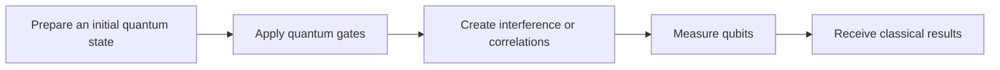
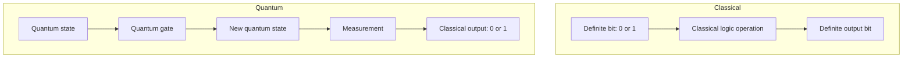
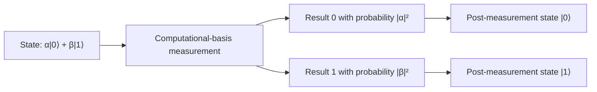
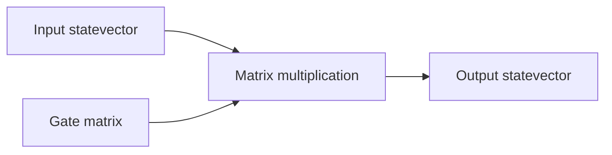
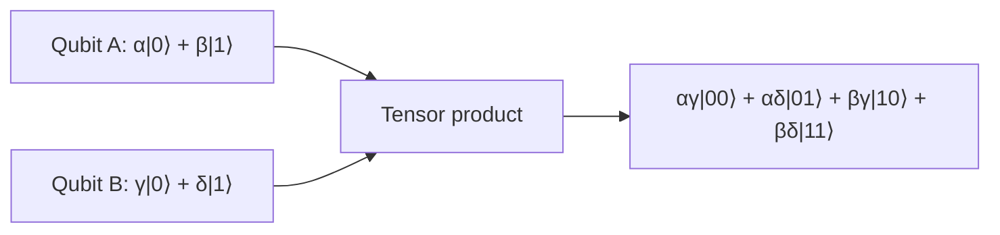
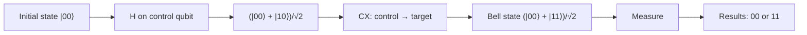
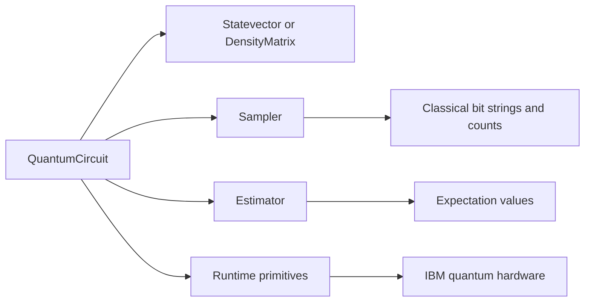
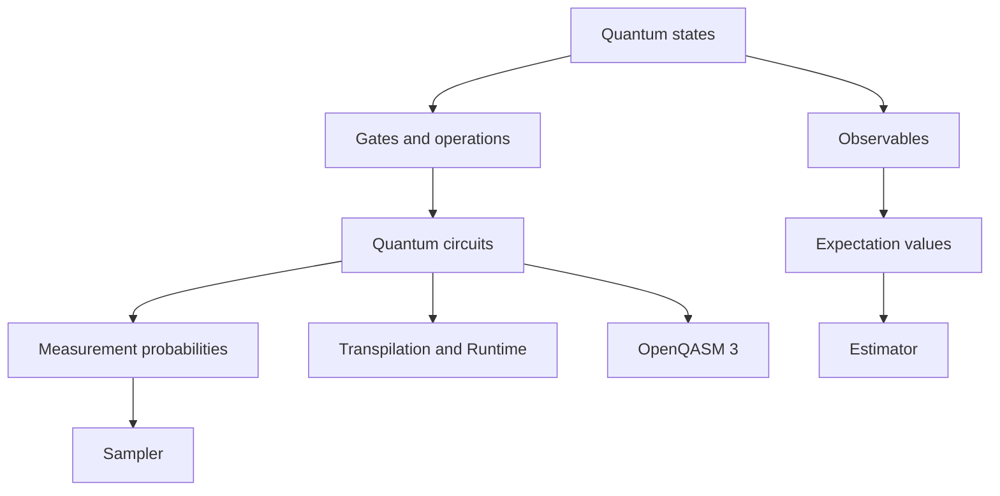

# Module 0: Quantum and Mathematical Foundations

Quantum computing is not classical programming with a few unusual commands.

It uses a different model for representing information, changing information, and extracting results. This chapter builds that model gradually. No previous knowledge of physics or linear algebra is assumed.

By the end of the module, you should understand the mathematical language used by quantum circuits and be able to represent these ideas using Qiskit.

---

## 0.1 Why Quantum Computing Needs New Foundations

A classical computer stores information using bits.

Each bit has a definite value:

$$
0
$$

or

$$
1
$$

A classical operation changes one definite bit pattern into another. For example, a NOT operation changes `0` into `1` and `1` into `0`.

Quantum computers use qubits. A qubit does not have to be described as only `0` or only `1` before it is measured. Its state can involve both possibilities, together with information called **phase**.

This changes how we must think about computation.

In classical programming, you normally ask:

> What value is stored in this variable?

In quantum computing, you often ask:

> What state is being prepared, how will its amplitudes change, and what outcomes could measurement produce?

A quantum program usually follows this pattern:



The input and output are still classical. You write classical code, send instructions to a quantum processor, and receive ordinary bit strings such as `00`, `01`, or `11`.

The unusual part happens between preparation and measurement.

### Classical-bit versus qubit flow



A quantum state is not directly visible. You learn about it through measurements and repeated experiments.

That is why quantum computing requires several new foundations:

* State vectors describe quantum states.
* Complex numbers describe probability amplitudes and phase.
* Matrices describe gates and observables.
* Matrix multiplication describes how gates transform states.
* Tensor products describe multiple qubits.
* Inner products help calculate overlaps and probabilities.
* Density matrices describe uncertainty and noise.
* Measurements convert quantum information into classical results.

We will introduce each idea only when it becomes necessary.

### Common misunderstanding

A quantum computer is not automatically faster than a classical computer.

Quantum advantage depends on finding an algorithm whose structure uses superposition, phase, interference, and entanglement in a useful way.

### Quick check

1. Why can we not describe every qubit as a definite classical `0` or `1`?
2. At what point does a quantum computation produce ordinary classical data?
3. Why do quantum developers need some knowledge of vectors and matrices?

---

## 0.2 Classical Bits and Qubits

### 0.2.1 Intuition

A classical bit has two possible states:

$$
0 \quad \text{or} \quad 1
$$

A qubit also has two basic states, but its complete state may be a combination of both.

The two basic qubit states are written:

$$
|0\rangle
$$

and

$$
|1\rangle
$$

The symbols are read as:

* $|0\rangle$: “ket zero”
* $|1\rangle$: “ket one”

The vertical bar and angled bracket form **ket notation**, also called Dirac notation.

### 0.2.2 Everyday analogy

Imagine an arrow that can point in different directions.

Two special directions are labelled `0` and `1`. A classical bit is restricted to one of those two labels. A qubit can have a state corresponding to other directions as well.

The analogy stops here: a qubit is not a tiny physical arrow. The arrow is only a visual representation of the mathematical state.

Another common analogy is a spinning coin. This can suggest that the qubit is secretly either heads or tails but moving too quickly to see. That is misleading. A quantum superposition is not merely an unknown classical value.

### 0.2.3 Formal definition

A **qubit** is a two-level quantum system whose pure state can be represented by a normalised vector in a two-dimensional complex vector space.

This definition contains several unfamiliar terms:

* **Two-level** means there are two computational basis states.
* **Vector** means the state is represented by an ordered list of numbers.
* **Complex** means the numbers may contain real and imaginary parts.
* **Normalised** means the total measurement probability is one.

Each term will be explained later.

### 0.2.4 Mathematical representation

A general single-qubit state is written:

$$
|\psi\rangle = \alpha|0\rangle+\beta|1\rangle
$$

Here:

* $|\psi\rangle$ means “the quantum state called psi.”
* $|0\rangle$ is the computational basis state zero.
* $|1\rangle$ is the computational basis state one.
* $\alpha$ is the amplitude associated with $|0\rangle$.
* $\beta$ is the amplitude associated with $|1\rangle$.

The Greek letter $\psi$, pronounced “sigh,” is commonly used as a name for a quantum state.

The amplitudes must satisfy:

$$
|\alpha|^2+|\beta|^2=1
$$

This condition ensures that the probabilities of all possible measurement outcomes add to 100%.

### 0.2.5 Worked example

Consider:

$$
|\psi\rangle=
\frac{\sqrt{3}}{2}|0\rangle+
\frac{1}{2}|1\rangle
$$

The amplitude of $|0\rangle$ is:

$$
\alpha=\frac{\sqrt{3}}{2}
$$

The amplitude of $|1\rangle$ is:

$$
\beta=\frac{1}{2}
$$

The probability of measuring `0` is the squared magnitude of $\alpha$:

$$
P(0)=\left|\frac{\sqrt{3}}{2}\right|^2
$$

Since the value is real, squaring its magnitude means ordinary squaring:

$$
P(0)=\frac{3}{4}=0.75
$$

The probability of measuring `1` is:

$$
P(1)=\left|\frac{1}{2}\right|^2
=\frac{1}{4}
=0.25
$$

The probabilities add to one:

$$
0.75+0.25=1
$$

### 0.2.6 Qiskit implementation

```python
from math import sqrt
from qiskit.quantum_info import Statevector

# Create the state:
# sqrt(3)/2 |0> + 1/2 |1>
state = Statevector([sqrt(3) / 2, 1 / 2])

print(state)
print(state.probabilities_dict())
```

Expected probability output:

```text
{'0': 0.75, '1': 0.25}
```

Line by line:

* `sqrt` is imported so that we can calculate $\sqrt{3}$.
* `Statevector` is Qiskit’s class for representing pure quantum states.
* The first list entry is the amplitude of $|0\rangle$.
* The second list entry is the amplitude of $|1\rangle$.
* `probabilities_dict()` squares the amplitude magnitudes and labels the resulting probabilities.

Qiskit’s `Statevector` can be created from a complex vector or from a quantum circuit.

### 0.2.7 Common misunderstanding

A qubit in superposition does not mean that measurement returns both `0` and `1` in one ordinary circuit execution.

A single measurement returns one classical result.

The state determines the probabilities of possible results across repeated preparations and measurements.

### 0.2.8 Quick check

1. What are the two computational basis states of a qubit?
2. What do $\alpha$ and $\beta$ represent?
3. For a valid state, what must $|\alpha|^2+|\beta|^2$ equal?

---

## 0.3 Quantum States

### 0.3.1 Intuition

A quantum state is the mathematical information needed to predict the possible results of measurements.

It is not a direct description of what you will definitely observe.

For example, a state may predict:

* a 50% chance of measuring `0`;
* a 50% chance of measuring `1`;
* different behaviour when measured in another basis.

The last point is important. Two states can produce identical probabilities when measured in the computational basis while behaving differently after another gate is applied.

### 0.3.2 Everyday analogy

A weather forecast may say:

* 70% probability of rain;
* 30% probability of no rain.

The forecast is not the weather event itself. It is information used to predict possible observations.

A quantum state also predicts possible observations.

The analogy stops because a classical weather event is normally assumed to have definite underlying physical conditions. Quantum amplitudes also contain phase information, which can later produce interference.

### 0.3.3 Formal definition

A pure quantum state is represented by a normalised state vector.

Two state vectors that differ only by an overall, or global, phase represent the same physical pure state.

### 0.3.4 Mathematical representation

For a single qubit:

$$
|\psi\rangle=\alpha|0\rangle+\beta|1\rangle
$$

The same state can be written as a column vector:

$$
|\psi\rangle=
\begin{bmatrix}
\alpha\\
\beta
\end{bmatrix}
$$

The top entry is the amplitude of $|0\rangle$.

The bottom entry is the amplitude of $|1\rangle$.

For example:

$$
|0\rangle=
\begin{bmatrix}
1\\
0
\end{bmatrix}
$$

and:

$$
|1\rangle=
\begin{bmatrix}
0\\
1
\end{bmatrix}
$$

### 0.3.5 Worked example

Consider:

$$
|\psi\rangle=
\frac{1}{\sqrt{2}}|0\rangle-
\frac{1}{\sqrt{2}}|1\rangle
$$

Its vector is:

$$
|\psi\rangle=
\begin{bmatrix}
\frac{1}{\sqrt{2}}\\
-\frac{1}{\sqrt{2}}
\end{bmatrix}
$$

The measurement probabilities are:

$$
P(0)=\left|\frac{1}{\sqrt{2}}\right|^2=\frac{1}{2}
$$

$$
P(1)=\left|-\frac{1}{\sqrt{2}}\right|^2=\frac{1}{2}
$$

The minus sign does not affect these two probabilities because squaring the magnitude removes the sign.

However, the minus sign affects later interference. It is therefore part of the quantum state.

### 0.3.6 Qiskit implementation

```python
from math import sqrt
from qiskit.quantum_info import Statevector

state = Statevector([1 / sqrt(2), -1 / sqrt(2)])

print("Vector:", state.data)
print("Probabilities:", state.probabilities_dict())
```

Expected output:

```text
Vector: [ 0.70710678+0.j -0.70710678+0.j]
Probabilities: {'0': 0.5, '1': 0.5}
```

Line by line:

* `state.data` returns the underlying complex vector.
* `0.j` means that the imaginary part is zero.
* Both amplitude magnitudes are $1/\sqrt{2}$.
* Both computational-basis probabilities are $1/2$.

### 0.3.7 Common misunderstanding

A quantum state is not always equivalent to a list of measurement probabilities.

The states

$$
\frac{|0\rangle+|1\rangle}{\sqrt{2}}
$$

and

$$
\frac{|0\rangle-|1\rangle}{\sqrt{2}}
$$

both produce 50–50 results in the computational basis. They are nevertheless different states because their relative phases differ.

### 0.3.8 Quick check

1. What information does a quantum state provide?
2. Why are probabilities alone sometimes insufficient to identify a state?
3. Which vector entry represents the amplitude of $|1\rangle$?

---

## 0.4 Computational Basis States

### 0.4.1 Intuition

The computational basis is the standard coordinate system used for qubits.

For one qubit, its basis states are:

$$
|0\rangle
\quad\text{and}\quad
|1\rangle
$$

They are analogous to the horizontal and vertical axes of a two-dimensional coordinate system.

Any single-qubit pure state can be written as a combination of these two basis states.

### 0.4.2 Everyday analogy

A location on a flat map can be described using an east-west coordinate and a north-south coordinate.

The location is not required to lie directly on either axis. The axes are reference directions used to describe it.

Similarly, a qubit state need not equal $|0\rangle$ or $|1\rangle$. Those states provide the reference basis used to describe it.

The analogy stops because quantum amplitudes may be complex numbers rather than ordinary geometric distances.

### 0.4.3 Formal definition

The computational basis of a single qubit is the orthonormal set:

$$
\{|0\rangle, |1\rangle\}
$$

“Orthonormal” means:

1. Each vector has length one.
2. The vectors are mutually orthogonal.

In this context, orthogonal states are perfectly distinguishable by a computational-basis measurement.

### 0.4.4 Mathematical representation

$$
|0\rangle=
\begin{bmatrix}
1\\
0
\end{bmatrix}
$$

$$
|1\rangle=
\begin{bmatrix}
0\\
1
\end{bmatrix}
$$

For $|0\rangle$:

* amplitude of zero = 1;
* amplitude of one = 0.

Therefore:

$$
P(0)=|1|^2=1
$$

$$
P(1)=|0|^2=0
$$

For $|1\rangle$, these probabilities are reversed.

### 0.4.5 Worked example

Suppose the state is:

$$
|\psi\rangle=0|0\rangle+1|1\rangle
$$

Removing the zero term gives:

$$
|\psi\rangle=|1\rangle
$$

The corresponding vector is:

$$
\begin{bmatrix}
0\\
1
\end{bmatrix}
$$

A computational-basis measurement returns `1` with probability one.

### 0.4.6 Qiskit implementation

#### Creating $|0\rangle$

```python
from qiskit.quantum_info import Statevector

zero = Statevector.from_label("0")

print(zero.data)
print(zero.probabilities_dict())
```

Expected output:

```text
[1.+0.j 0.+0.j]
{'0': 1.0}
```

#### Creating $|1\rangle$

```python
from qiskit.quantum_info import Statevector

one = Statevector.from_label("1")

print(one.data)
print(one.probabilities_dict())
```

Expected output:

```text
[0.+0.j 1.+0.j]
{'1': 1.0}
```

`Statevector.from_label()` creates commonly used labelled states without manually entering their amplitudes.

### 0.4.7 Common misunderstanding

The symbol $|0\rangle$ does not mean the number zero.

It names a vector:

$$
\begin{bmatrix}
1\\
0
\end{bmatrix}
$$

Similarly, $|1\rangle$ names a vector rather than the ordinary number one.

### 0.4.8 Quick check

1. Write $|0\rangle$ as a column vector.
2. What is the probability of measuring `1` from $|0\rangle$?
3. Why are $|0\rangle$ and $|1\rangle$ called basis states?

---

## 0.5 Superposition and Probability Amplitudes

### 0.5.1 Intuition

A superposition is a quantum state containing nonzero amplitudes for more than one basis state.

For example:

$$
|\psi\rangle=
\frac{|0\rangle+|1\rangle}{\sqrt{2}}
$$

This state contains amplitudes for both $|0\rangle$ and $|1\rangle$.

Measurement still returns only one classical result. Before measurement, however, both amplitudes can participate in quantum interference.

### 0.5.2 Everyday analogy

Two water waves can overlap. Their heights combine, and depending on their phases, they may reinforce or cancel each other.

Probability amplitudes also combine before probabilities are calculated.

The analogy stops because a quantum state is not necessarily a physical water wave. The useful similarity is that amplitudes can add or cancel.

### 0.5.3 Formal definition

A state is a superposition relative to a chosen basis when it is represented as a linear combination of multiple basis vectors.

For a single qubit:

$$
|\psi\rangle=\alpha|0\rangle+\beta|1\rangle
$$

If both $\alpha$ and $\beta$ are nonzero, the state is a superposition of the computational basis states.

Superposition is basis-dependent. A state may be a superposition in one basis and a basis state in another.

### 0.5.4 Probability amplitudes

The numbers $\alpha$ and $\beta$ are **probability amplitudes**.

They are not probabilities.

To obtain a measurement probability, take the squared magnitude:

$$
P(0)=|\alpha|^2
$$

$$
P(1)=|\beta|^2
$$

If an amplitude is a real number, its squared magnitude is its ordinary square.

If an amplitude is complex, we will use its complex magnitude.

### 0.5.5 Normalisation

All possible outcome probabilities must add to one:

$$
|\alpha|^2+|\beta|^2=1
$$

This is called the **normalisation condition**.

Consider the vector:

$$
\begin{bmatrix}
1\\
1
\end{bmatrix}
$$

The squared magnitudes add to:

$$
1^2+1^2=2
$$

Therefore, this is not normalised.

To normalise it, divide each entry by the square root of the total:

$$
\sqrt{2}
$$

The normalised vector is:

$$
\begin{bmatrix}
\frac{1}{\sqrt{2}}\\
\frac{1}{\sqrt{2}}
\end{bmatrix}
$$

### 0.5.6 The plus and minus states

Two important superposition states are:

$$
|+\rangle=
\frac{|0\rangle+|1\rangle}{\sqrt{2}}
$$

and:

$$
|-\rangle=
\frac{|0\rangle-|1\rangle}{\sqrt{2}}
$$

Both produce 50–50 computational-basis probabilities.

Their difference is relative phase.

### 0.5.7 Worked example

Consider:

$$
|\psi\rangle=
\frac{i}{\sqrt{2}}|0\rangle+
\frac{1}{\sqrt{2}}|1\rangle
$$

Here $i$ is the imaginary unit.

The magnitude of $i$ is one, so:

$$
\left|\frac{i}{\sqrt{2}}\right|^2
= \frac{|i|^2}{2}
= \frac{1}{2}
$$

For the second amplitude:

$$
\left|\frac{1}{\sqrt{2}}\right|^2
=

\frac{1}{2}
$$

Therefore:

$$
P(0)=\frac{1}{2}
$$

$$
P(1)=\frac{1}{2}
$$

The state is normalised because:

$$
\frac{1}{2}+\frac{1}{2}=1
$$

### 0.5.8 Qiskit implementation

#### Creating $|+\rangle$

```python
from qiskit import QuantumCircuit
from qiskit.quantum_info import Statevector

circuit = QuantumCircuit(1)
circuit.h(0)

plus_state = Statevector.from_instruction(circuit)

print(plus_state.data)
print(plus_state.probabilities_dict())
```

Expected output:

```text
[0.70710678+0.j 0.70710678+0.j]
{'0': 0.5, '1': 0.5}
```

Line by line:

* `QuantumCircuit(1)` creates a circuit containing one qubit.
* Qiskit qubits begin in $|0\rangle$ unless prepared differently.
* `h(0)` applies a Hadamard gate to qubit zero.
* The Hadamard gate changes $|0\rangle$ into $|+\rangle$.
* `Statevector.from_instruction()` calculates the circuit’s resulting ideal pure state.
* `probabilities_dict()` reports computational-basis probabilities.

#### Creating $|-\rangle$

```python
from qiskit import QuantumCircuit
from qiskit.quantum_info import Statevector

circuit = QuantumCircuit(1)

# |0> --X--> |1> --H--> |->
circuit.x(0)
circuit.h(0)

minus_state = Statevector.from_instruction(circuit)

print(minus_state.data)
print(minus_state.probabilities_dict())
```

Expected statevector:

```text
[ 0.70710678+0.j -0.70710678+0.j]
```

Line by line:

* The X gate changes $|0\rangle$ into $|1\rangle$.
* The H gate changes $|1\rangle$ into $|-\rangle$.
* The two computational-basis probabilities are both 0.5.
* The negative second amplitude records the state’s relative phase.

### 0.5.9 Common misunderstandings

**Mistake 1:** An amplitude of $1/2$ means a probability of $1/2$.

It does not. The probability is:

$$
\left|\frac{1}{2}\right|^2=\frac{1}{4}
$$

**Mistake 2:** A qubit in superposition stores two ordinary bits.

A single qubit does not provide two independently readable classical values. Measurement returns one bit.

**Mistake 3:** Superposition means lack of knowledge.

A classical bit that is secretly either `0` or `1` is not generally equivalent to a coherent quantum superposition.

### 0.5.10 Quick check

1. Is an amplitude the same as a probability?
2. Why is the vector $[1,1]^T$ not a valid statevector?
3. What are the computational-basis probabilities of $|-\rangle$?

---

## 0.6 Measurement

### 0.6.1 Intuition

Measurement converts quantum information into a classical result.

For a single qubit measured in the computational basis, the possible outcomes are:

$$
0
\quad\text{or}\quad
1
$$

The state’s amplitudes determine the probabilities.

### 0.6.2 Everyday analogy

Imagine drawing a coloured ball from a bag. Repeating the experiment allows you to estimate the probability of each colour.

The analogy is useful for understanding repeated samples.

It stops being accurate because quantum measurement can also disturb the state, and quantum probabilities arise from amplitudes that can interfere.

### 0.6.3 Formal definition

For the state:

$$
|\psi\rangle=\alpha|0\rangle+\beta|1\rangle
$$

a computational-basis measurement produces:

* outcome `0` with probability $|\alpha|^2$;
* outcome `1` with probability $|\beta|^2$.

After an ideal projective measurement, the post-measurement state corresponds to the observed outcome.

If the result is `0`, the state becomes $|0\rangle$.

If the result is `1`, the state becomes $|1\rangle$.

This update is often called **collapse**.

### 0.6.4 Measurement process



### 0.6.5 Shots

A **shot** is one execution and measurement of a circuit.

Because one shot gives only one sample, quantum experiments are usually repeated.

Suppose a state has:

$$
P(0)=0.5
$$

and:

$$
P(1)=0.5
$$

With 1,000 shots, you might receive:

```text
{'0': 487, '1': 513}
```

You should not expect exactly 500 of each every time. The counts fluctuate because sampling is random.

As the number of shots increases, observed frequencies usually approach the underlying probabilities.

### 0.6.6 Worked example

For:

$$
|\psi\rangle=
\frac{\sqrt{3}}{2}|0\rangle+
\frac{1}{2}|1\rangle
$$

we calculated:

$$
P(0)=0.75
$$

$$
P(1)=0.25
$$

For 1,000 shots, the expected counts are approximately:

$$
1000 \times 0.75=750
$$

and:

$$
1000 \times 0.25=250
$$

An actual run might produce:

```text
{'0': 764, '1': 236}
```

This would still be consistent with the expected distribution.

### 0.6.7 Exact probabilities versus sampled counts

A statevector simulator can calculate ideal probabilities directly.

A sampler produces finite-shot results, which contain statistical variation.

These are different tasks:

```text
Exact statevector calculation:
P(0) = 0.5
P(1) = 0.5

Finite sampling:
0 appeared 496 times
1 appeared 504 times
```

### 0.6.8 Qiskit implementation

#### Calculating exact probabilities

```python
from qiskit import QuantumCircuit
from qiskit.quantum_info import Statevector

circuit = QuantumCircuit(1)
circuit.h(0)

state = Statevector.from_instruction(circuit)

print(state.probabilities_dict())
```

Expected output:

```text
{'0': 0.5, '1': 0.5}
```

#### Simulating repeated measurements

```python
from qiskit import QuantumCircuit
from qiskit.primitives import StatevectorSampler

circuit = QuantumCircuit(1)

# Prepare |+>
circuit.h(0)

# Sampler circuits must contain measurements.
circuit.measure_all()

sampler = StatevectorSampler(seed=42)
job = sampler.run([circuit], shots=1000)
result = job.result()

counts = result[0].data.meas.get_counts()
print(counts)
```

A possible output is:

```text
{'0': 497, '1': 503}
```

Line by line:

* `StatevectorSampler` is Qiskit’s local V2 reference sampler.
* `measure_all()` adds classical output bits and measurements.
* `seed=42` makes this simulated sampling reproducible.
* `run([circuit], shots=1000)` executes one sampler work item using 1,000 shots.
* `result[0]` selects the result for the first circuit.
* `data.meas` accesses the classical register created by `measure_all()`.
* `get_counts()` converts the shot data into a count dictionary.

Circuits submitted to a sampler need measurement instructions because Sampler returns sampled classical register data. `StatevectorSampler` performs local statevector-based simulation and does not represent execution on IBM hardware.

### 0.6.9 Simulation versus real hardware

The previous example is simulation.

A local statevector simulation assumes ideal gate behaviour unless a separate noise model is used.

A real quantum processor may produce additional outcomes because of:

* imperfect state preparation;
* gate errors;
* qubit relaxation;
* dephasing;
* readout errors;
* unwanted interactions;
* calibration drift.

Real hardware execution normally uses Qiskit Runtime primitives after the circuit has been transpiled for a selected backend.

### 0.6.10 Common misunderstandings

**Mistake 1:** Fifty-fifty probability guarantees equal counts.

It does not. Equal probability allows statistical variation.

**Mistake 2:** Measurement reveals all amplitudes.

A single computational-basis measurement returns one bit string, not the statevector.

**Mistake 3:** Shots are copies of one continuously existing qubit.

Each shot normally involves preparing and running the experiment again.

### 0.6.11 Quick check

1. What is a shot?
2. Why might 1,000 shots from $|+\rangle$ not produce exactly 500 zeros?
3. What happens to an ideal qubit after a computational-basis measurement returns `1`?

---

## 0.7 Complex Numbers

### 0.7.1 Why quantum computing needs them

Real numbers are not enough to describe all quantum states and transformations.

Quantum amplitudes may be complex numbers.

A complex number contains:

* a real part;
* an imaginary part.

It is written:

$$
z=a+bi
$$

Here:

* $z$ names the complex number;
* $a$ is the real part;
* $b$ is the imaginary coefficient;
* $i$ is the imaginary unit.

The imaginary unit is defined by:

$$
i^2=-1
$$

### 0.7.2 Intuition

A real number can be shown on a number line.

A complex number can be shown on a plane:

* the horizontal axis represents the real part;
* the vertical axis represents the imaginary part.

For example:

$$
3+2i
$$

corresponds to the point three units to the right and two units upward.

### 0.7.3 Everyday analogy

A street location may require two coordinates: east-west and north-south.

Similarly, a complex number requires two real values.

The analogy stops because complex-number multiplication also rotates and scales values in a structured mathematical way.

### 0.7.4 Complex conjugate

The complex conjugate of:

$$
z=a+bi
$$

is:

$$
z^*=a-bi
$$

The star means complex conjugation.

Example:

$$
z=3+2i
$$

$$
z^*=3-2i
$$

### 0.7.5 Magnitude

The magnitude of $z=a+bi$ is:

$$
|z|=\sqrt{a^2+b^2}
$$

This is the distance from the origin in the complex plane.

For:

$$
z=3+4i
$$

the magnitude is:

$$
|z|=\sqrt{3^2+4^2}
$$

$$
|z|=\sqrt{9+16}
$$

$$
|z|=\sqrt{25}=5
$$

The squared magnitude is:

$$
|z|^2=25
$$

It can also be calculated using the complex conjugate:

$$
|z|^2=z^*z
$$

For $3+4i$:

$$
(3-4i)(3+4i)
$$

Multiplying:

$$
=9+12i-12i-16i^2
$$

Since $i^2=-1$:

$$
=9+16=25
$$

### 0.7.6 Why squared magnitudes become probabilities

Suppose an amplitude is:

$$
\alpha=\frac{1+i}{2}
$$

Its real part is $1/2$.

Its imaginary part is $1/2$.

The squared magnitude is:

$$
|\alpha|^2=
\left(\frac{1}{2}\right)^2+
\left(\frac{1}{2}\right)^2
$$

$$
|\alpha|^2=
\frac{1}{4}+\frac{1}{4}
=\frac{1}{2}
$$

Therefore, an amplitude of $(1+i)/2$ corresponds to a probability of $1/2$.

### 0.7.7 Polar form and phase

A complex number may also be written:

$$
z=re^{i\theta}
$$

Here:

* $r$ is its magnitude;
* $\theta$ is its angle, called its phase;
* $e$ is Euler’s number;
* $i$ is the imaginary unit.

Euler’s formula states:

$$
e^{i\theta}=\cos\theta+i\sin\theta
$$

You do not need to derive this formula for this module.

Important special cases include:

$$
e^{i0}=1
$$

$$
e^{i\pi/2}=i
$$

$$
e^{i\pi}=-1
$$

$$
e^{i3\pi/2}=-i
$$

Complex phase is essential because quantum gates can rotate amplitudes without changing their magnitudes.

### 0.7.8 Worked example

Consider:

$$
|\psi\rangle=
\frac{1+i}{2}|0\rangle+
\frac{1-i}{2}|1\rangle
$$

For the first amplitude:

$$
\left|\frac{1+i}{2}\right|^2
= \frac{1^2+1^2}{2^2}
= \frac{2}{4}
= \frac{1}{2}
$$

For the second amplitude:

$$
\left|\frac{1-i}{2}\right|^2
= \frac{1^2+(-1)^2}{2^2}
= \frac{2}{4}
= \frac{1}{2}
$$

The state is normalised:

$$
\frac{1}{2}+\frac{1}{2}=1
$$

### 0.7.9 Python implementation

```python
amplitude = (1 + 1j) / 2

probability = abs(amplitude) ** 2

print(amplitude)
print(probability)
```

Expected output:

```text
(0.5+0.5j)
0.5
```

Line by line:

* Python writes the imaginary unit as `j`, not `i`.
* `1j` represents $i$.
* `abs(amplitude)` calculates the complex magnitude.
* Squaring the magnitude gives the corresponding probability.

### 0.7.10 Common misunderstandings

**Mistake 1:** Imaginary numbers are not real mathematics.

Complex numbers are a standard mathematical system used throughout engineering and physics.

**Mistake 2:** The probability of $a+bi$ is $(a+bi)^2$.

The probability uses the squared magnitude:

$$
|a+bi|^2=a^2+b^2
$$

**Mistake 3:** Two amplitudes with equal magnitudes are equivalent.

They can have different phases and therefore produce different interference later.

### 0.7.11 Quick check

1. What is $i^2$?
2. What is the complex conjugate of $2-3i$?
3. Calculate $|3+4i|^2$.

---

## 0.8 Vectors and Statevectors

### 0.8.1 Intuition

A vector is an ordered list of numbers.

In quantum computing, a statevector stores one amplitude for every computational basis state.

For one qubit, there are two basis states, so the statevector has two entries.

For two qubits, there are four basis states, so the statevector has four entries.

### 0.8.2 Geometric analogy

An ordinary two-dimensional vector can describe a direction and length:

$$
\begin{bmatrix}
x\\
y
\end{bmatrix}
$$

A single-qubit statevector also has two entries:

$$
\begin{bmatrix}
\alpha\\
\beta
\end{bmatrix}
$$

The analogy stops because qubit statevectors use complex numbers and are interpreted through quantum measurement rules.

### 0.8.3 Formal definition

A vector is an ordered element of a vector space.

A pure $n$-qubit statevector contains:

$$
2^n
$$

complex amplitudes.

A valid statevector has norm one.

For:

$$
|\psi\rangle=
\begin{bmatrix}
\alpha\\
\beta
\end{bmatrix}
$$

the squared norm is:

$$
\lVert\psi\rVert^2=|\alpha|^2+|\beta|^2
$$

A valid state requires:

$$
\lVert\psi\rVert^2=1
$$

### 0.8.4 Vector addition

Vectors are added entry by entry.

For example:

$$
\begin{bmatrix}
1\\
0
\end{bmatrix}
+
\begin{bmatrix}
0\\
1
\end{bmatrix}
=

\begin{bmatrix}
1\\
1
\end{bmatrix}
$$

To turn this into a normalised quantum state:

$$
\frac{1}{\sqrt{2}}
\left(
\begin{bmatrix}
1\\
0
\end{bmatrix}
+
\begin{bmatrix}
0\\
1
\end{bmatrix}
\right)
=

\begin{bmatrix}
1/\sqrt{2}\\
1/\sqrt{2}
\end{bmatrix}
$$

This is $|+\rangle$.

### 0.8.5 Scalar multiplication

A scalar is a number that multiplies every vector entry.

For example:

$$
2
\begin{bmatrix}
1\\
3
\end{bmatrix}
=

\begin{bmatrix}
2\\
6
\end{bmatrix}
$$

In quantum mechanics, multiplying a complete state by a complex number of magnitude one changes only its global phase.

### 0.8.6 Worked example: normalising a vector

Suppose:

$$
v=
\begin{bmatrix}
2\\
-i
\end{bmatrix}
$$

First calculate the sum of squared magnitudes:

$$
|2|^2+|-i|^2
$$

$$
=4+1=5
$$

The length is:

$$
\sqrt{5}
$$

Divide each entry by $\sqrt{5}$:

$$
|\psi\rangle=
\begin{bmatrix}
2/\sqrt{5}\\
-i/\sqrt{5}
\end{bmatrix}
$$

Check:

$$
\left|\frac{2}{\sqrt{5}}\right|^2+
\left|\frac{-i}{\sqrt{5}}\right|^2
=

\frac{4}{5}+\frac{1}{5}
=1
$$

### 0.8.7 Qiskit implementation

```python
import numpy as np
from qiskit.quantum_info import Statevector

raw_vector = np.array([2, -1j], dtype=complex)

norm = np.linalg.norm(raw_vector)
normalised_vector = raw_vector / norm

state = Statevector(normalised_vector)

print("Norm:", norm)
print("Statevector:", state.data)
print("Probabilities:", state.probabilities_dict())
```

Expected probabilities:

```text
{'0': 0.8, '1': 0.2}
```

Line by line:

* `np.array` creates an ordered numerical vector.
* `dtype=complex` allows real and imaginary entries.
* `np.linalg.norm` calculates the vector’s length.
* Dividing by the norm normalises the vector.
* `Statevector` wraps the normalised vector as a Qiskit quantum state.
* The squared magnitudes are $4/5$ and $1/5$.

### 0.8.8 Common misunderstanding

A statevector entry is not the measured value of a qubit.

It is an amplitude associated with an entire basis state.

For multiple qubits, each entry corresponds to a complete bit string such as $|00\rangle$ or $|101\rangle$.

### 0.8.9 Quick check

1. How many entries does a three-qubit statevector contain?
2. What condition must a valid statevector satisfy?
3. What does each statevector entry represent?

---

## 0.9 Matrices and Quantum Gates

### 0.9.1 Intuition

A matrix is a rectangular arrangement of numbers.

Matrices describe transformations.

A quantum gate changes a statevector. Mathematically, this change is represented by multiplying a gate matrix by the statevector.



### 0.9.2 Everyday analogy

A graphics program may transform an object by rotating, stretching, or reflecting its coordinates.

A transformation matrix specifies how the coordinates change.

Quantum gates similarly transform amplitude vectors.

The analogy stops because valid closed-system quantum gates are restricted to **unitary** matrices, which preserve total probability.

### 0.9.3 Matrix dimensions

A matrix with two rows and two columns is a $2\times2$ matrix:

$$
A=
\begin{bmatrix}
a&b\\
c&d
\end{bmatrix}
$$

A single-qubit gate uses a $2\times2$ matrix because a single-qubit state has two amplitudes.

A two-qubit gate uses a $4\times4$ matrix because a two-qubit state has four amplitudes.

### 0.9.4 Unitary matrices

A valid ideal quantum gate is represented by a unitary matrix.

A unitary transformation:

* preserves the length of the statevector;
* preserves total probability;
* is reversible.

If $U$ is unitary:

$$
U^\dagger U=I
$$

Here:

* $U^\dagger$ is the conjugate transpose of $U$;
* $I$ is the identity matrix.

You do not need to verify unitarity manually for standard Qiskit gates.

### 0.9.5 Identity gate

The identity matrix is:

$$
I=
\begin{bmatrix}
1&0\\
0&1
\end{bmatrix}
$$

It leaves a state unchanged.

### 0.9.6 X gate

The Pauli-X matrix is:

$$
X=
\begin{bmatrix}
0&1\\
1&0
\end{bmatrix}
$$

It swaps the amplitudes of $|0\rangle$ and $|1\rangle$.

Therefore:

$$
X|0\rangle=|1\rangle
$$

and:

$$
X|1\rangle=|0\rangle
$$

It is sometimes compared to a classical NOT gate, although it also acts meaningfully on superpositions.

### 0.9.7 Z gate

The Pauli-Z matrix is:

$$
Z=
\begin{bmatrix}
1&0\\
0&-1
\end{bmatrix}
$$

It leaves the $|0\rangle$ amplitude unchanged and negates the $|1\rangle$ amplitude.

Therefore:

$$
Z|0\rangle=|0\rangle
$$

$$
Z|1\rangle=-|1\rangle
$$

For the plus state:

$$
Z|+\rangle=|-\rangle
$$

### 0.9.8 Hadamard gate

The Hadamard matrix is:

$$
H=
\frac{1}{\sqrt{2}}
\begin{bmatrix}
1&1\\
1&-1
\end{bmatrix}
$$

It performs:

$$
H|0\rangle=|+\rangle
$$

$$
H|1\rangle=|-\rangle
$$

It also reverses these transformations:

$$
H|+\rangle=|0\rangle
$$

$$
H|-\rangle=|1\rangle
$$

The Hadamard gate is important because it converts phase differences into computational-basis differences.

### 0.9.9 CX gate

The controlled-X gate, written CX or CNOT, acts on two qubits.

It has:

* a control qubit;
* a target qubit.

The target is flipped only when the control is $|1\rangle$.

For control first and target second:

$$
|00\rangle\rightarrow|00\rangle
$$

$$
|01\rangle\rightarrow|01\rangle
$$

$$
|10\rangle\rightarrow|11\rangle
$$

$$
|11\rangle\rightarrow|10\rangle
$$

The exact matrix layout depends on the adopted bit-ordering convention. In Qiskit, controlled gates normally use the argument order `(control, target)`, while displayed bit strings place the highest-index bit on the left.

### 0.9.10 Qiskit implementation

```python
from qiskit import QuantumCircuit
from qiskit.quantum_info import Statevector

circuit = QuantumCircuit(1)

# |0> -> |1>
circuit.x(0)

state = Statevector.from_instruction(circuit)

print(circuit.draw())
print(state.data)
```

Expected statevector:

```text
[0.+0.j 1.+0.j]
```

Line by line:

* A one-qubit circuit begins in $|0\rangle$.
* `x(0)` applies Pauli-X to qubit zero.
* The output becomes $|1\rangle$.
* `draw()` prints a text circuit diagram.

#### Applying Z after H

```python
from qiskit import QuantumCircuit
from qiskit.quantum_info import Statevector

circuit = QuantumCircuit(1)

# |0> --H--> |+> --Z--> |->
circuit.h(0)
circuit.z(0)

state = Statevector.from_instruction(circuit)

print(state.data)
```

Expected statevector:

```text
[ 0.70710678+0.j -0.70710678+0.j]
```

### 0.9.11 Common misunderstandings

**Mistake 1:** The Z gate does nothing because it does not change computational-basis probabilities.

It can change later results by changing relative phase.

**Mistake 2:** H always creates randomness.

H maps $|0\rangle$ and $|1\rangle$ to equal superpositions, but it maps $|+\rangle$ to definite $|0\rangle$.

**Mistake 3:** CX copies any qubit.

It copies computational-basis information in certain cases. Applied to a superposition, it can create entanglement rather than two independent copies.

### 0.9.12 Quick check

1. Which gate swaps the amplitudes of $|0\rangle$ and $|1\rangle$?
2. Which gate changes $|+\rangle$ into $|-\rangle$?
3. Why must ideal gate matrices preserve vector length?

---

## 0.10 Matrix Multiplication

### 0.10.1 Intuition

Matrix multiplication tells us how a gate transforms a state.

The gate matrix is written on the left:

$$
|\psi_{\text{out}}\rangle
=

U|\psi_{\text{in}}\rangle
$$

Here:

* $U$ is the gate matrix;
* $|\psi_{\text{in}}\rangle$ is the input state;
* $|\psi_{\text{out}}\rangle$ is the output state.

The order matters.

### 0.10.2 Multiplying a matrix by a vector

Consider:

$$
\begin{bmatrix}
a&b\\
c&d
\end{bmatrix}
\begin{bmatrix}
x\\
y
\end{bmatrix}
$$

The output’s first entry is:

$$
ax+by
$$

The output’s second entry is:

$$
cx+dy
$$

Therefore:

$$
\begin{bmatrix}
a&b\\
c&d
\end{bmatrix}
\begin{bmatrix}
x\\
y
\end{bmatrix}
=

\begin{bmatrix}
ax+by\\
cx+dy
\end{bmatrix}
$$

Each output entry is formed by multiplying one matrix row with the input column and adding the results.

### 0.10.3 Worked example: X acting on $|0\rangle$

The X gate is:

$$
X=
\begin{bmatrix}
0&1\\
1&0
\end{bmatrix}
$$

The state $|0\rangle$ is:

$$
|0\rangle=
\begin{bmatrix}
1\\
0
\end{bmatrix}
$$

Multiply:

$$
X|0\rangle
=

\begin{bmatrix}
0&1\\
1&0
\end{bmatrix}
\begin{bmatrix}
1\\
0
\end{bmatrix}
$$

First output entry:

$$
0(1)+1(0)=0
$$

Second output entry:

$$
1(1)+0(0)=1
$$

Therefore:

$$
X|0\rangle=
\begin{bmatrix}
0\\
1
\end{bmatrix}
=

|1\rangle
$$

### 0.10.4 Worked example: H acting on $|0\rangle$

$$
H=
\frac{1}{\sqrt{2}}
\begin{bmatrix}
1&1\\
1&-1
\end{bmatrix}
$$

Multiply:

$$
H|0\rangle
=

\frac{1}{\sqrt{2}}
\begin{bmatrix}
1&1\\
1&-1
\end{bmatrix}
\begin{bmatrix}
1\\
0
\end{bmatrix}
$$

First entry:

$$
\frac{1}{\sqrt{2}}\left(1(1)+1(0)\right)
=

\frac{1}{\sqrt{2}}
$$

Second entry:

$$
\frac{1}{\sqrt{2}}\left(1(1)-1(0)\right)
=

\frac{1}{\sqrt{2}}
$$

Therefore:

$$
H|0\rangle=
\begin{bmatrix}
1/\sqrt{2}\\
1/\sqrt{2}
\end{bmatrix}
=

|+\rangle
$$

### 0.10.5 Worked example: H acting on $|-\rangle$

Start with:

$$
|-\rangle=
\frac{1}{\sqrt{2}}
\begin{bmatrix}
1\\
-1
\end{bmatrix}
$$

Then:

$$
H|-\rangle
=

\frac{1}{2}
\begin{bmatrix}
1&1\\
1&-1
\end{bmatrix}
\begin{bmatrix}
1\\
-1
\end{bmatrix}
$$

First entry:

$$
\frac{1}{2}(1-1)=0
$$

Second entry:

$$
\frac{1}{2}(1+1)=1
$$

Therefore:

$$
H|-\rangle=
\begin{bmatrix}
0\\
1
\end{bmatrix}
=

|1\rangle
$$

The negative phase has been converted into a definite measurement difference.

### 0.10.6 Multiple gates

If X is applied first and H second:

$$
|\psi_{\text{out}}\rangle=HX|\psi_{\text{in}}\rangle
$$

The rightmost matrix acts first.

This is similar to nested function calls:

```python
output = H(X(input_state))
```

### 0.10.7 Qiskit implementation

```python
import numpy as np

zero = np.array([1, 0], dtype=complex)

x_gate = np.array(
    [
        [0, 1],
        [1, 0],
    ],
    dtype=complex,
)

output = x_gate @ zero

print(output)
```

Expected output:

```text
[0.+0.j 1.+0.j]
```

Line by line:

* `zero` stores the vector for $|0\rangle$.
* `x_gate` stores the X matrix.
* Python’s `@` operator performs matrix multiplication.
* The result is the vector for $|1\rangle$.

### 0.10.8 Common misunderstanding

Matrix multiplication is not performed entry by entry.

For example:

$$
\begin{bmatrix}
a&b\\
c&d
\end{bmatrix}
\begin{bmatrix}
x\\
y
\end{bmatrix}
$$

does not become:

$$
\begin{bmatrix}
ax\\
dy
\end{bmatrix}
$$

Each output entry uses a complete row.

### 0.10.9 Quick check

1. In $HX|\psi\rangle$, which gate acts first?
2. Calculate $X|1\rangle$.
3. Why can a phase change become visible after a Hadamard gate?

---

## 0.11 Inner Products

### 0.11.1 Intuition

An inner product compares two vectors.

It tells us how strongly one state overlaps with another.

For normalised quantum states:

* an overlap magnitude of one means the states are equivalent up to global phase;
* an overlap of zero means the states are orthogonal;
* intermediate values mean partial overlap.

### 0.11.2 Bra notation

A ket is a column vector:

$$
|\psi\rangle
$$

The corresponding **bra** is written:

$$
\langle\psi|
$$

To obtain the bra:

1. transpose the column vector into a row;
2. take the complex conjugate of each entry.

If:

$$
|\psi\rangle=
\begin{bmatrix}
a\\
b
\end{bmatrix}
$$

then:

$$
\langle\psi|=
\begin{bmatrix}
a^*&b^*
\end{bmatrix}
$$

### 0.11.3 Formal definition

The inner product between $|\phi\rangle$ and $|\psi\rangle$ is:

$$
\langle\phi|\psi\rangle
$$

If:

$$
|\phi\rangle=
\begin{bmatrix}
a\\
b
\end{bmatrix}
$$

and:

$$
|\psi\rangle=
\begin{bmatrix}
c\\
d
\end{bmatrix}
$$

then:

$$
\langle\phi|\psi\rangle=a^*c+b^*d
$$

### 0.11.4 Worked example: basis-state overlap

Calculate:

$$
\langle0|1\rangle
$$

We have:

$$
\langle0|=
\begin{bmatrix}
1&0
\end{bmatrix}
$$

and:

$$
|1\rangle=
\begin{bmatrix}
0\\
1
\end{bmatrix}
$$

Therefore:

$$
\langle0|1\rangle
=

1(0)+0(1)=0
$$

The states are orthogonal.

Now calculate:

$$
\langle0|0\rangle
$$

$$

1(1)+0(0)=1
$$

### 0.11.5 Inner products and measurement probability

The amplitude for finding $|\psi\rangle$ in basis state $|0\rangle$ is:

$$
\langle0|\psi\rangle
$$

The corresponding probability is:

$$
|\langle0|\psi\rangle|^2
$$

For:

$$
|\psi\rangle=\alpha|0\rangle+\beta|1\rangle
$$

we obtain:

$$
\langle0|\psi\rangle=\alpha
$$

and therefore:

$$
P(0)=|\alpha|^2
$$

### 0.11.6 Worked example

Let:

$$
|\psi\rangle=
\frac{3}{5}|0\rangle+
\frac{4}{5}|1\rangle
$$

Then:

$$
\langle1|\psi\rangle
=

\begin{bmatrix}
0&1
\end{bmatrix}
\begin{bmatrix}
3/5\\
4/5
\end{bmatrix}
=

\frac{4}{5}
$$

The probability of outcome `1` is:

$$
\left|\frac{4}{5}\right|^2
= \frac{16}{25}
= 0.64
$$

### 0.11.7 Qiskit implementation

```python
from qiskit.quantum_info import Statevector, state_fidelity

zero = Statevector.from_label("0")
plus = Statevector.from_label("+")

overlap = zero.inner(plus)

print("Inner product:", overlap)
print("Squared magnitude:", abs(overlap) ** 2)
print("State fidelity:", state_fidelity(zero, plus))
```

Expected output is approximately:

```text
Inner product: (0.7071067811865475+0j)
Squared magnitude: 0.5
State fidelity: 0.5
```

Line by line:

* `zero.inner(plus)` calculates $\langle0|+\rangle$.
* Its value is $1/\sqrt{2}$.
* Squaring its magnitude gives $1/2$.
* For pure states, state fidelity equals the squared overlap magnitude.

### 0.11.8 Common misunderstanding

The inner product is not always an ordinary dot product.

For complex vectors, the first vector must be complex-conjugated.

### 0.11.9 Quick check

1. What does an inner product of zero indicate?
2. Why must complex conjugation be used?
3. What is $|\langle1|+\rangle|^2$?

---

## 0.12 Phase

### 0.12.1 Intuition

Phase describes the angular part of a complex amplitude.

Phase often does not change immediate computational-basis probabilities. It can still change future results because amplitudes with different phases interfere differently.

There are two important kinds of phase:

* global phase;
* relative phase.

### 0.12.2 Global phase

Consider:

$$
|\psi\rangle=
\alpha|0\rangle+\beta|1\rangle
$$

Now multiply the entire state by $e^{i\gamma}$:

$$
|\psi'\rangle=
e^{i\gamma}
\left(
\alpha|0\rangle+\beta|1\rangle
\right)
$$

The same factor multiplies every amplitude.

This is a **global phase**.

The states $|\psi\rangle$ and $|\psi'\rangle$ represent the same physical pure state.

Example:

$$
|0\rangle
$$

and:

$$
-|0\rangle
$$

differ by a global phase of $-1=e^{i\pi}$.

They give identical predictions in every experiment.

### 0.12.3 Relative phase

Consider:

$$
|+\rangle=
\frac{|0\rangle+|1\rangle}{\sqrt{2}}
$$

and:

$$
|-\rangle=
\frac{|0\rangle-|1\rangle}{\sqrt{2}}
$$

The minus sign affects only the $|1\rangle$ term.

This is a relative phase difference.

Relative phase is physically meaningful because it affects interference.

### 0.12.4 Worked example: making phase visible

Start with:

$$
|+\rangle=
\frac{|0\rangle+|1\rangle}{\sqrt{2}}
$$

Apply H:

$$
H|+\rangle=|0\rangle
$$

Therefore, measurement returns `0` with certainty.

Now start with:

$$
|-\rangle=
\frac{|0\rangle-|1\rangle}{\sqrt{2}}
$$

Apply H:

$$
H|-\rangle=|1\rangle
$$

Measurement now returns `1` with certainty.

Before H, both states had 50–50 computational-basis probabilities.

After H, their relative phases produce opposite deterministic outcomes.

### 0.12.5 Z gate and phase

The Z gate transforms:

$$
\alpha|0\rangle+\beta|1\rangle
$$

into:

$$
\alpha|0\rangle-\beta|1\rangle
$$

It adds a phase of $\pi$ to the $|1\rangle$ component.

For $|+\rangle$:

$$
Z|+\rangle=|-\rangle
$$

### 0.12.6 Qiskit implementation

```python
from qiskit import QuantumCircuit
from qiskit.quantum_info import Statevector

without_z = QuantumCircuit(1)
without_z.h(0)
without_z.h(0)

with_z = QuantumCircuit(1)
with_z.h(0)
with_z.z(0)
with_z.h(0)

state_without_z = Statevector.from_instruction(without_z)
state_with_z = Statevector.from_instruction(with_z)

print("H then H:", state_without_z.probabilities_dict())
print("H then Z then H:", state_with_z.probabilities_dict())
```

Expected output:

```text
H then H: {'0': 1.0}
H then Z then H: {'1': 1.0}
```

Line by line:

* The first H creates $|+\rangle$.
* Without Z, the second H returns the state to $|0\rangle$.
* With Z, $|+\rangle$ becomes $|-\rangle$.
* The final H changes $|-\rangle$ into $|1\rangle$.
* The Z gate’s phase change becomes visible through interference.

### 0.12.7 Common misunderstandings

**Mistake 1:** Phase never matters because probabilities use squared magnitudes.

Relative phase can change how amplitudes combine after later gates.

**Mistake 2:** A minus sign always changes the physical state.

Multiplying every amplitude by minus one is only global phase. Negating one component relative to another changes relative phase.

### 0.12.8 Quick check

1. Are $|0\rangle$ and $-|0\rangle$ physically different pure states?
2. Are $|+\rangle$ and $|-\rangle$ physically different?
3. Which gate converts their phase difference into a computational-basis result?

---

## 0.13 The Bloch Sphere

### 0.13.1 Intuition

The Bloch sphere is a geometric representation of a single pure qubit state.

Every point on the surface represents one single-qubit pure state, up to global phase.

Important points include:

* north pole: $|0\rangle$;
* south pole: $|1\rangle$;
* positive x-direction: $|+\rangle$;
* negative x-direction: $|-\rangle$;
* positive y-direction: $(|0\rangle+i|1\rangle)/\sqrt{2}$;
* negative y-direction: $(|0\rangle-i|1\rangle)/\sqrt{2}$.

### 0.13.2 Formal representation

Any pure single-qubit state can be written, up to global phase, as:

$$
|\psi\rangle=
\cos\left(\frac{\theta}{2}\right)|0\rangle+
e^{i\phi}
\sin\left(\frac{\theta}{2}\right)|1\rangle
$$

Here:

* $\theta$ controls the vertical position;
* $\phi$ controls the angle around the vertical axis;
* $e^{i\phi}$ represents relative phase.

The angle ranges are usually:

$$
0\leq\theta\leq\pi
$$

$$
0\leq\phi<2\pi
$$

### 0.13.3 Why half-angles appear

The state uses:

$$
\cos(\theta/2)
$$

and:

$$
\sin(\theta/2)
$$

rather than $\cos\theta$ and $\sin\theta$.

This relationship arises from the geometry of qubit state space and quantum rotations. You do not need to derive it for this module.

### 0.13.4 Worked examples

For the north pole:

$$
\theta=0
$$

Then:

$$
\cos(0/2)=1
$$

$$
\sin(0/2)=0
$$

Therefore:

$$
|\psi\rangle=|0\rangle
$$

For the south pole:

$$
\theta=\pi
$$

Then:

$$
\cos(\pi/2)=0
$$

$$
\sin(\pi/2)=1
$$

Therefore:

$$
|\psi\rangle=e^{i\phi}|1\rangle
$$

The factor $e^{i\phi}$ is global phase because it multiplies the only nonzero component. The physical state is therefore $|1\rangle$.

For $|+\rangle$:

$$
\theta=\frac{\pi}{2}
\quad\text{and}\quad
\phi=0
$$

This gives:

$$
|\psi\rangle=
\frac{|0\rangle+|1\rangle}{\sqrt{2}}
$$

### 0.13.5 Gates as rotations

Single-qubit gates can often be visualised as rotations of the Bloch vector.

For example:

* X rotates by $\pi$ around the x-axis;
* Y rotates by $\pi$ around the y-axis;
* Z rotates by $\pi$ around the z-axis;
* rotation gates such as `rx`, `ry`, and `rz` rotate by specified angles.

The Hadamard gate is also a rotation, although describing it only as a rotation around x, y, or z would be incomplete.

### 0.13.6 What the Bloch sphere does not represent

The Bloch sphere does not show:

* two independent classical values;
* a qubit physically located at a point in ordinary three-dimensional space;
* the state space of several qubits as an ordinary sphere;
* the full structure of entanglement;
* an arbitrary mixed state on the surface.

Pure single-qubit states lie on the surface.

Mixed single-qubit states lie inside the sphere.

### 0.13.7 Qiskit implementation

```python
from qiskit.quantum_info import Statevector

plus = Statevector.from_label("+")

# In a notebook, this returns a Bloch-sphere visualisation.
figure = plus.draw(output="bloch")

print(figure)
```

Line by line:

* `Statevector.from_label("+")` creates $|+\rangle$.
* `draw(output="bloch")` requests a Bloch-sphere visualisation.
* In a graphical notebook environment, Qiskit displays the Bloch sphere.
* In a plain terminal, graphical display depends on the environment.

### 0.13.8 Common misunderstanding

The north and south poles do not mean that all other points are uncertain versions of a secretly definite pole.

Surface points represent genuine pure quantum states, many of which are coherent superpositions in the computational basis.

### 0.13.9 Quick check

1. Which state lies at the Bloch sphere’s north pole?
2. Where are pure states located?
3. Why can the Bloch sphere not directly represent an entangled two-qubit state?

---

## 0.14 Multiple Qubits and Tensor Products

### 0.14.1 Intuition

A system of multiple qubits needs amplitudes for every possible combined basis state.

Two qubits have four basis states:

$$
|00\rangle,\ |01\rangle,\ |10\rangle,\ |11\rangle
$$

Three qubits have eight basis states.

In general, $n$ qubits have:

$$
2^n
$$

computational basis states.

This exponential growth is central to both the power and difficulty of quantum computation.

### 0.14.2 Tensor products

The tensor product combines state spaces.

It is written using:

$$
\otimes
$$

For example:

$$
|0\rangle\otimes|1\rangle=|01\rangle
$$

The tensor product of vectors is also called the Kronecker product.

### 0.14.3 Everyday analogy

Suppose one menu contains two drinks and another menu contains two meals.

The combined choices are:

* drink 0 with meal 0;
* drink 0 with meal 1;
* drink 1 with meal 0;
* drink 1 with meal 1.

The number of joint possibilities multiplies.

The analogy stops because quantum amplitudes can interfere, and some joint quantum states cannot be separated into independent choices.

### 0.14.4 Tensor-product calculation

Let:

$$
|0\rangle=
\begin{bmatrix}
1\\
0
\end{bmatrix}
$$

and:

$$
|1\rangle=
\begin{bmatrix}
0\\
1
\end{bmatrix}
$$

Then:

$$
|0\rangle\otimes|1\rangle
=

\begin{bmatrix}
1
\begin{bmatrix}
0\\
1
\end{bmatrix}\\
0
\begin{bmatrix}
0\\
1
\end{bmatrix}
\end{bmatrix}
$$

This gives:

$$
\begin{bmatrix}
0\\
1\\
0\\
0
\end{bmatrix}
$$

which represents:

$$
|01\rangle
$$

### 0.14.5 General two-qubit product state

Suppose:

$$
|\psi\rangle=
\alpha|0\rangle+\beta|1\rangle
$$

and:

$$
|\phi\rangle=
\gamma|0\rangle+\delta|1\rangle
$$

Their joint state is:

$$
|\psi\rangle\otimes|\phi\rangle
$$

Expanding:

$$

\alpha\gamma|00\rangle+
\alpha\delta|01\rangle+
\beta\gamma|10\rangle+
\beta\delta|11\rangle
$$

The joint amplitudes are products of the individual amplitudes.

### 0.14.6 Multi-qubit construction



### 0.14.7 Worked example: $|+\rangle\otimes|0\rangle$

$$
|+\rangle=
\frac{|0\rangle+|1\rangle}{\sqrt{2}}
$$

Therefore:

$$
|+\rangle\otimes|0\rangle
=

\frac{|00\rangle+|10\rangle}{\sqrt{2}}
$$

The possible outcomes are:

* `00` with probability $1/2$;
* `10` with probability $1/2$.

The second qubit is always zero in the written mathematical order used here.

### 0.14.8 Qiskit bit ordering

Qiskit labels qubit zero as the least-significant bit.

In displayed strings, the highest-index bit appears on the left and qubit zero appears on the right.

For two qubits, Qiskit displays:

```text
q1 q0
```

Therefore, if X is applied to qubit zero, the displayed basis state is:

```text
01
```

not:

```text
10
```

Qiskit stores the statevector amplitude at index $x$ for basis state $|x\rangle$, with qubit zero on the right side of tensor-product labels.

### 0.14.9 Qiskit implementation

```python
from qiskit import QuantumCircuit
from qiskit.quantum_info import Statevector

circuit = QuantumCircuit(2)

# Put qubit 0 in |+>.
# Qubit 1 remains in |0>.
circuit.h(0)

state = Statevector.from_instruction(circuit)

print(state.data)
print(state.probabilities_dict())
```

Expected probability dictionary:

```text
{'00': 0.5, '01': 0.5}
```

Line by line:

* Both qubits begin in $|0\rangle$, giving $|00\rangle$.
* H acts on qubit zero.
* Qiskit prints qubit one on the left and qubit zero on the right.
* Therefore, qubit zero changing produces `00` and `01`.

#### Creating a multi-qubit state directly

```python
from qiskit.quantum_info import Statevector

state = Statevector.from_label("0+")

print(state.data)
print(state.probabilities_dict())
```

Expected probabilities:

```text
{'00': 0.5, '01': 0.5}
```

In the string `"0+"`:

* the left symbol describes qubit one;
* the right symbol describes qubit zero.

### 0.14.10 Exponential growth

The number of amplitudes grows as follows:

| Qubits | Statevector entries |
| -----: | ------------------: |
|      1 |                   2 |
|      2 |                   4 |
|      3 |                   8 |
|     10 |               1,024 |
|     20 |           1,048,576 |
|     30 |       1,073,741,824 |

This does not mean that all amplitudes can be efficiently read from a quantum computer. Measurement returns samples, not the complete vector.

### 0.14.11 Common misunderstandings

**Mistake 1:** Two qubits require four bits of output.

One shot returns two classical measurement bits.

**Mistake 2:** The full statevector can be directly printed from hardware.

Statevectors can be accessed in ideal simulations. Real hardware provides measurement results, from which properties must be estimated.

**Mistake 3:** Qiskit displays qubit zero on the left of a result string.

Qubit zero is normally displayed on the right.

### 0.14.12 Quick check

1. How many amplitudes are required for five qubits?
2. What does the tensor product combine?
3. In Qiskit’s string `10`, which qubit has value one in a two-qubit circuit?

---

## 0.15 Entanglement

### 0.15.1 Intuition

Entanglement occurs when the state of a multi-qubit system cannot be separated into an independent state for each qubit.

Consider:

$$
|\Phi^+\rangle=
\frac{|00\rangle+|11\rangle}{\sqrt{2}}
$$

This state says that the joint system has amplitudes for `00` and `11`.

It cannot be written as:

$$
|\psi\rangle\otimes|\phi\rangle
$$

for any two single-qubit states $|\psi\rangle$ and $|\phi\rangle$.

The pair has a well-defined joint quantum state, while each qubit alone does not have its own pure statevector.

### 0.15.2 Everyday analogy

Two sealed cards might be prepared so that one says red and the other says black. Opening one reveals what the other card must contain.

That classical example shows correlation.

Quantum entanglement can also produce strong correlations, but it is not merely an unknown prewritten pair of classical answers. Quantum correlations can depend on the measurement bases and can violate inequalities satisfied by local hidden-variable models.

The analogy therefore captures correlation but not the full quantum behaviour.

### 0.15.3 Formal definition

A pure state of two subsystems is entangled if it cannot be expressed as a tensor product of subsystem states.

A separable pure state has the form:

$$
|\psi\rangle_A\otimes|\phi\rangle_B
$$

An entangled pure state does not.

### 0.15.4 Why the Bell state is not separable

Suppose:

$$
|\psi\rangle=
a|0\rangle+b|1\rangle
$$

and:

$$
|\phi\rangle=
c|0\rangle+d|1\rangle
$$

Their product is:

$$
ac|00\rangle+ad|01\rangle+bc|10\rangle+bd|11\rangle
$$

For $|\Phi^+\rangle$, we would need:

$$
ac=\frac{1}{\sqrt{2}}
$$

$$
ad=0
$$

$$
bc=0
$$

$$
bd=\frac{1}{\sqrt{2}}
$$

The first and last equations require $a,b,c,d$ to be nonzero.

But then $ad$ and $bc$ cannot both be zero.

Therefore, the Bell state cannot be a product state.

### 0.15.5 Correlation without communication

If both qubits in $|\Phi^+\rangle$ are measured in the computational basis, the results agree:

* `00`;
* or `11`.

Each local outcome is random.

One observer cannot choose whether their result is zero or one. Therefore, the correlation cannot be used to send a controllable message faster than light.

Entanglement creates correlations, not an instant communication channel.

### 0.15.6 Qiskit implementation

```python
from qiskit import QuantumCircuit
from qiskit.quantum_info import Statevector

circuit = QuantumCircuit(2)

# Create superposition on qubit 0.
circuit.h(0)

# Entangle qubit 0 with qubit 1.
circuit.cx(0, 1)

state = Statevector.from_instruction(circuit)

print(state.data)
print(state.probabilities_dict())
```

Expected probabilities:

```text
{'00': 0.5, '11': 0.5}
```

Line by line:

* The initial state is $|00\rangle$.
* H on qubit zero creates a superposition involving $|00\rangle$ and $|01\rangle$ in Qiskit ordering.
* CX uses qubit zero as control and qubit one as target.
* The `q0=1` branch flips qubit one.
* The output becomes $(|00\rangle+|11\rangle)/\sqrt{2}$.

### 0.15.7 Common misunderstandings

**Mistake 1:** Any correlated result proves entanglement.

Classical systems can also be correlated. Entanglement is a property of the quantum state.

**Mistake 2:** Entanglement allows controlled faster-than-light messaging.

Local outcomes remain uncontrollable.

**Mistake 3:** Entangled qubits each possess a separate pure statevector.

The complete pair has a pure statevector, but the individual qubits are described by mixed reduced states.

### 0.15.8 Quick check

1. What makes a pure two-qubit state entangled?
2. Why does entanglement not provide instant messaging?
3. Can the Bell state be written as a product of two single-qubit states?

---

## 0.16 Bell States

### 0.16.1 The four Bell states

The four standard Bell states are:

$$
|\Phi^+\rangle=
\frac{|00\rangle+|11\rangle}{\sqrt{2}}
$$

$$
|\Phi^-\rangle=
\frac{|00\rangle-|11\rangle}{\sqrt{2}}
$$

$$
|\Psi^+\rangle=
\frac{|01\rangle+|10\rangle}{\sqrt{2}}
$$

$$
|\Psi^-\rangle=
\frac{|01\rangle-|10\rangle}{\sqrt{2}}
$$

They form an orthonormal basis for the two-qubit state space.

### 0.16.2 Building $|\Phi^+\rangle$

Start with:

$$
|00\rangle
$$

Apply H to the first qubit:

$$
|00\rangle
\rightarrow
\frac{|00\rangle+|10\rangle}{\sqrt{2}}
$$

Using the first qubit as CX control and the second as target:

$$
|00\rangle\rightarrow|00\rangle
$$

$$
|10\rangle\rightarrow|11\rangle
$$

Therefore:

$$
\frac{|00\rangle+|10\rangle}{\sqrt{2}}
\rightarrow
\frac{|00\rangle+|11\rangle}{\sqrt{2}}
$$

### 0.16.3 Bell-state circuit



### 0.16.4 Measurement predictions

For:

$$
|\Phi^+\rangle=
\frac{|00\rangle+|11\rangle}{\sqrt{2}}
$$

the amplitudes are:

* $|00\rangle$: $1/\sqrt{2}$;
* $|01\rangle$: $0$;
* $|10\rangle$: $0$;
* $|11\rangle$: $1/\sqrt{2}$.

The probabilities are:

$$
P(00)=\frac{1}{2}
$$

$$
P(01)=0
$$

$$
P(10)=0
$$

$$
P(11)=\frac{1}{2}
$$

### 0.16.5 Qiskit implementation

```python
from qiskit import QuantumCircuit
from qiskit.quantum_info import Statevector

bell = QuantumCircuit(2)

bell.h(0)
bell.cx(0, 1)

state = Statevector.from_instruction(bell)

print(bell.draw())
print(state.data)
print(state.probabilities_dict())
```

Expected statevector:

```text
[0.70710678+0.j 0.        +0.j 0.        +0.j 0.70710678+0.j]
```

The four entries correspond to:

```text
|00>, |01>, |10>, |11>
```

### 0.16.6 Measuring the Bell state

```python
from qiskit import QuantumCircuit
from qiskit.primitives import StatevectorSampler

bell = QuantumCircuit(2)

bell.h(0)
bell.cx(0, 1)
bell.measure_all()

sampler = StatevectorSampler(seed=7)
result = sampler.run([bell], shots=1000).result()

counts = result[0].data.meas.get_counts()
print(counts)
```

A possible output is:

```text
{'00': 506, '11': 494}
```

Line by line:

* H creates a superposition on qubit zero.
* CX entangles the two qubits.
* `measure_all()` measures both qubits.
* The sampler repeats the ideal experiment 1,000 times.
* Only `00` and `11` should appear in an ideal simulation.
* Their counts should be approximately equal.

### 0.16.7 Common misunderstanding

The Bell state does not mean that both qubits have definite matching values before every possible measurement.

It predicts correlations that depend on the chosen measurement bases.

### 0.16.8 Quick check

1. Name the four Bell states.
2. Which gates create $|\Phi^+\rangle$ from $|00\rangle$?
3. Which computational-basis outcomes are impossible for $|\Phi^+\rangle$?

---

## 0.17 Observables and Expectation Values

### 0.17.1 Intuition

An observable represents a measurable physical quantity.

In quantum computing, common observables include the Pauli operators:

$$
X,\quad Y,\quad Z
$$

An observable has possible measurement values called **eigenvalues**.

For the Pauli observables, the eigenvalues are:

$$
+1
\quad\text{and}\quad
-1
$$

### 0.17.2 Everyday analogy

Suppose you repeatedly measure the result of an experiment and encode outcomes as:

* success: $+1$;
* failure: $-1$.

The average of many results is an expectation value.

The analogy stops because a quantum observable also determines the measurement basis and mathematical operator.

### 0.17.3 Z observable

The Pauli-Z observable is:

$$
Z=
\begin{bmatrix}
1&0\\
0&-1
\end{bmatrix}
$$

Its computational-basis eigenstates are:

$$
Z|0\rangle=+|0\rangle
$$

$$
Z|1\rangle=-|1\rangle
$$

Therefore, a Z measurement can be interpreted as assigning:

* outcome $|0\rangle$: value $+1$;
* outcome $|1\rangle$: value $-1$.

### 0.17.4 Expectation value

For a state $|\psi\rangle$ and observable $A$, the expectation value is:

$$
\langle A\rangle
=

\langle\psi|A|\psi\rangle
$$

This is the average value predicted over many repetitions.

It does not generally mean that one individual measurement returns the expectation value.

### 0.17.5 Expectation from probabilities

For a Z measurement:

$$
\langle Z\rangle=
(+1)P(0)+(-1)P(1)
$$

Therefore:

$$
\langle Z\rangle=P(0)-P(1)
$$

### 0.17.6 Worked examples

For $|0\rangle$:

$$
P(0)=1,\quad P(1)=0
$$

Therefore:

$$
\langle Z\rangle=1-0=1
$$

For $|1\rangle$:

$$
P(0)=0,\quad P(1)=1
$$

Therefore:

$$
\langle Z\rangle=0-1=-1
$$

For $|+\rangle$:

$$
P(0)=\frac{1}{2},\quad P(1)=\frac{1}{2}
$$

Therefore:

$$
\langle Z\rangle=
\frac{1}{2}-\frac{1}{2}=0
$$

### 0.17.7 Matrix calculation

For:

$$
|\psi\rangle=
\begin{bmatrix}
\alpha\\
\beta
\end{bmatrix}
$$

first calculate:

$$
Z|\psi\rangle=
\begin{bmatrix}
1&0\\
0&-1
\end{bmatrix}
\begin{bmatrix}
\alpha\\
\beta
\end{bmatrix}
=

\begin{bmatrix}
\alpha\\
-\beta
\end{bmatrix}
$$

Then multiply by:

$$
\langle\psi|=
\begin{bmatrix}
\alpha^*&\beta^*
\end{bmatrix}
$$

This gives:

$$
\langle Z\rangle
=

|\alpha|^2-|\beta|^2
$$

### 0.17.8 Two-qubit observables

An observable such as:

$$
Z\otimes Z
$$

often written `ZZ`, measures parity-like correlation.

Its values are:

* `00`: $+1$;
* `01`: $-1$;
* `10`: $-1$;
* `11`: $+1$.

For $|\Phi^+\rangle$, only `00` and `11` occur, so:

$$
\langle ZZ\rangle=1
$$

This indicates perfect matching correlation in the Z basis.

### 0.17.9 Qiskit implementation using a statevector

```python
from qiskit.quantum_info import Statevector, Pauli

plus = Statevector.from_label("+")
z_observable = Pauli("Z")

expectation = plus.expectation_value(z_observable)

print(expectation)
```

Expected output:

```text
0j
```

This means the expectation value is zero, with no imaginary component.

Line by line:

* `Pauli("Z")` represents the Pauli-Z observable.
* `expectation_value()` calculates $\langle\psi|Z|\psi\rangle$.
* For $|+\rangle$, the positive and negative Z outcomes are equally likely.
* Their average is zero.

### 0.17.10 Qiskit implementation using Estimator

```python
from qiskit import QuantumCircuit
from qiskit.primitives import StatevectorEstimator
from qiskit.quantum_info import SparsePauliOp

circuit = QuantumCircuit(1)
circuit.h(0)

observable = SparsePauliOp("Z")

estimator = StatevectorEstimator()
job = estimator.run([(circuit, observable)])
result = job.result()

expectation = result[0].data.evs
print(expectation)
```

Expected result:

```text
0.0
```

Line by line:

* The circuit prepares $|+\rangle$.
* `SparsePauliOp("Z")` represents the Z observable.
* `StatevectorEstimator` is Qiskit’s local V2 reference estimator.
* A primitive input item contains the circuit and observable.
* `result[0].data.evs` retrieves the expectation value.
* The result is exact for this unitary ideal statevector calculation.

The V2 Estimator abstraction evaluates circuit–observable combinations, while `StatevectorEstimator` is the local reference implementation for Pauli-based observables.

### 0.17.11 Sampler versus Estimator

Use Sampler when you want:

* measured bit strings;
* shot data;
* counts or probabilities;
* samples from classical registers.

Use Estimator when you want:

* an expectation value;
* an average observable value;
* quantities such as $\langle Z\rangle$, $\langle XX\rangle$, or Hamiltonian expectations.

### 0.17.12 Common misunderstandings

**Mistake 1:** An expectation value must be one possible measurement outcome.

A Pauli measurement returns $+1$ or $-1$, but its expectation may be any number between them.

**Mistake 2:** An expectation value is a probability.

It is a weighted average of possible observable values.

**Mistake 3:** Estimator returns ordinary measurement counts.

Estimator returns expectation-value estimates and associated metadata.

### 0.17.13 Quick check

1. What are the eigenvalues of Pauli Z?
2. What is $\langle Z\rangle$ for $|1\rangle$?
3. When should you use Estimator rather than Sampler?

---

## 0.18 Pure and Mixed States

### 0.18.1 Pure states

A pure state contains the most complete quantum description allowed by the model.

It can be represented by a normalised statevector:

$$
|\psi\rangle
$$

Examples include:

$$
|0\rangle
$$

$$
|+\rangle
$$

$$
\frac{|00\rangle+|11\rangle}{\sqrt{2}}
$$

### 0.18.2 Mixed states

A mixed state represents statistical uncertainty over quantum states or the reduced state of part of an entangled system.

Suppose a source prepares:

* $|0\rangle$ with probability $1/2$;
* $|1\rangle$ with probability $1/2$.

This is not the same as $|+\rangle$.

Both produce 50–50 results in the computational basis, but they behave differently in the X basis.

### 0.18.3 Distinguishing a mixture from a superposition

For $|+\rangle$:

$$
H|+\rangle=|0\rangle
$$

Therefore, after H, measurement returns `0` with certainty.

For an equal classical mixture of $|0\rangle$ and $|1\rangle$:

* half the preparations are $|0\rangle$, which H maps to $|+\rangle$;
* half are $|1\rangle$, which H maps to $|-\rangle$.

Both $|+\rangle$ and $|-\rangle$ produce 50–50 computational-basis outcomes.

Therefore, the mixture remains 50–50 after H.

The difference is **coherence**. The pure superposition has a definite relative phase. The mixture does not.

### 0.18.4 Density matrices

A density matrix represents both pure and mixed states.

For a pure state:

$$
\rho=|\psi\rangle\langle\psi|
$$

The Greek letter $\rho$, pronounced “rho,” commonly names a density matrix.

### 0.18.5 Worked example: density matrix of $|0\rangle$

$$
|0\rangle=
\begin{bmatrix}
1\\
0
\end{bmatrix}
$$

$$
\langle0|=
\begin{bmatrix}
1&0
\end{bmatrix}
$$

Take the outer product:

$$
|0\rangle\langle0|
=

\begin{bmatrix}
1\\
0
\end{bmatrix}
\begin{bmatrix}
1&0
\end{bmatrix}
$$

Therefore:

$$
\rho_0=
\begin{bmatrix}
1&0\\
0&0
\end{bmatrix}
$$

### 0.18.6 Density matrix of $|+\rangle$

$$
|+\rangle=
\frac{1}{\sqrt{2}}
\begin{bmatrix}
1\\
1
\end{bmatrix}
$$

Therefore:

$$
\rho_+
=

|+\rangle\langle+|
$$

$$

\frac{1}{2}
\begin{bmatrix}
1\\
1
\end{bmatrix}
\begin{bmatrix}
1&1
\end{bmatrix}
$$

$$

\frac{1}{2}
\begin{bmatrix}
1&1\\
1&1
\end{bmatrix}
$$

The off-diagonal entries represent coherence between the basis states.

### 0.18.7 Equal classical mixture

For an equal mixture of $|0\rangle$ and $|1\rangle$:

$$
\rho_{\text{mixed}}
=

\frac{1}{2}|0\rangle\langle0|
+
\frac{1}{2}|1\rangle\langle1|
$$

This gives:

$$
\rho_{\text{mixed}}
=

\frac{1}{2}
\begin{bmatrix}
1&0\\
0&0
\end{bmatrix}
+
\frac{1}{2}
\begin{bmatrix}
0&0\\
0&1
\end{bmatrix}
$$

$$

\begin{bmatrix}
1/2&0\\
0&1/2
\end{bmatrix}
$$

Compare:

$$
\rho_+
=

\begin{bmatrix}
1/2&1/2\\
1/2&1/2
\end{bmatrix}
$$

with:

$$
\rho_{\text{mixed}}
=

\begin{bmatrix}
1/2&0\\
0&1/2
\end{bmatrix}
$$

They have the same diagonal probabilities but different off-diagonal coherence.

### 0.18.8 Density-matrix properties

A valid density matrix:

1. is Hermitian;
2. has trace one;
3. has nonnegative eigenvalues.

The trace is the sum of diagonal entries.

For:

$$
\begin{bmatrix}
1/2&0\\
0&1/2
\end{bmatrix}
$$

the trace is:

$$
\frac{1}{2}+\frac{1}{2}=1
$$

### 0.18.9 Purity

Purity is calculated as:

$$
\operatorname{Tr}(\rho^2)
$$

For a pure state:

$$
\operatorname{Tr}(\rho^2)=1
$$

For a mixed state, the value is less than one.

For the maximally mixed single-qubit state:

$$
\rho=
\frac{I}{2}
$$

the purity is:

$$
\frac{1}{2}
$$

### 0.18.10 Reduced states and entanglement

The Bell state is a pure two-qubit state:

$$
|\Phi^+\rangle=
\frac{|00\rangle+|11\rangle}{\sqrt{2}}
$$

However, if you describe only one of its qubits and ignore the other, the reduced state is:

$$
\rho_{\text{one qubit}}
=

\frac{I}{2}
$$

Thus:

* the complete pair is pure;
* either individual qubit is mixed.

### 0.18.11 Qiskit implementation

#### Inspecting a pure-state density matrix

```python
from qiskit.quantum_info import Statevector, DensityMatrix

plus_state = Statevector.from_label("+")
plus_density = DensityMatrix(plus_state)

print(plus_density.data)
print("Purity:", plus_density.purity())
```

Expected matrix:

```text
[[0.5+0.j 0.5+0.j]
 [0.5+0.j 0.5+0.j]]
```

Expected purity:

```text
1.0
```

Line by line:

* `Statevector.from_label("+")` creates the pure plus state.
* `DensityMatrix(plus_state)` converts it to $|+\rangle\langle+|$.
* The off-diagonal entries are nonzero.
* `purity()` returns one because the state is pure.

#### Creating a maximally mixed state

```python
import numpy as np
from qiskit.quantum_info import DensityMatrix

mixed = DensityMatrix(
    np.array(
        [
            [0.5, 0.0],
            [0.0, 0.5],
        ],
        dtype=complex,
    )
)

print(mixed.data)
print("Probabilities:", mixed.probabilities_dict())
print("Purity:", mixed.purity())
```

Expected output:

```text
Probabilities: {'0': 0.5, '1': 0.5}
Purity: 0.5
```

Qiskit’s `DensityMatrix` class can be constructed from a statevector, circuit, instruction, or explicit matrix.

### 0.18.12 Common misunderstandings

**Mistake 1:** A 50–50 mixture is the same as $|+\rangle$.

They agree only for some measurements.

**Mistake 2:** Density matrices are used only for noisy states.

They can represent pure states as well.

**Mistake 3:** If the total state is pure, every subsystem must be pure.

Subsystems of an entangled pure state can be mixed.

### 0.18.13 Quick check

1. What is the density matrix of a pure state?
2. How does $|+\rangle$ differ from an equal mixture of $|0\rangle$ and $|1\rangle$?
3. What purity value identifies a pure state?

---

## 0.19 Quantum States in Qiskit

Qiskit provides different objects for different levels of a quantum program.

### 0.19.1 `QuantumCircuit`

`QuantumCircuit` stores an ordered sequence of operations.

It represents what should be done, not necessarily the final state itself.

```python
from qiskit import QuantumCircuit

circuit = QuantumCircuit(2)
circuit.h(0)
circuit.cx(0, 1)

print(circuit.draw())
```

The circuit contains:

* two qubits;
* an H gate on qubit zero;
* a CX gate from qubit zero to qubit one.

### 0.19.2 `Statevector`

`Statevector` represents an ideal pure quantum state.

```python
from qiskit import QuantumCircuit
from qiskit.quantum_info import Statevector

circuit = QuantumCircuit(2)
circuit.h(0)
circuit.cx(0, 1)

state = Statevector.from_instruction(circuit)

print(state.data)
print(state.probabilities_dict())
```

It is appropriate when:

* the state remains pure;
* the circuit contains no unhandled measurement;
* you want ideal amplitudes;
* the system is small enough for classical simulation.

A statevector contains $2^n$ complex values for $n$ qubits, so simulation cost grows exponentially.

### 0.19.3 `DensityMatrix`

`DensityMatrix` represents pure or mixed states.

```python
from qiskit import QuantumCircuit
from qiskit.quantum_info import DensityMatrix

circuit = QuantumCircuit(1)
circuit.h(0)

density = DensityMatrix.from_instruction(circuit)

print(density.data)
```

It is useful for:

* mixtures;
* reduced states;
* noisy evolution;
* open-system reasoning;
* comparing coherent and incoherent states.

A density matrix for $n$ qubits has dimensions:

$$
2^n\times2^n
$$

It therefore requires substantially more classical memory than a statevector.

### 0.19.4 `StatevectorSampler`

`StatevectorSampler` is a local implementation of the V2 Sampler interface.

It samples measured classical outputs using ideal statevector simulation.

```python
from qiskit import QuantumCircuit
from qiskit.primitives import StatevectorSampler

circuit = QuantumCircuit(1)
circuit.h(0)
circuit.measure_all()

sampler = StatevectorSampler(seed=10)
result = sampler.run([circuit], shots=1000).result()

print(result[0].data.meas.get_counts())
```

This is simulation, not real-hardware execution.

### 0.19.5 `StatevectorEstimator`

`StatevectorEstimator` is a local implementation of the V2 Estimator interface.

It calculates expectation values from circuits and observables.

```python
from qiskit import QuantumCircuit
from qiskit.primitives import StatevectorEstimator
from qiskit.quantum_info import SparsePauliOp

circuit = QuantumCircuit(1)
circuit.x(0)

observable = SparsePauliOp("Z")

estimator = StatevectorEstimator()
result = estimator.run([(circuit, observable)]).result()

print(result[0].data.evs)
```

Expected output:

```text
-1.0
```

### 0.19.6 `Operator`

`Operator` represents a matrix transformation.

```python
from qiskit.circuit.library import HGate
from qiskit.quantum_info import Operator

operator = Operator(HGate())

print(operator.data)
```

Expected matrix:

```text
[[ 0.70710678+0.j  0.70710678+0.j]
 [ 0.70710678+0.j -0.70710678+0.j]]
```

### 0.19.7 `Pauli` and `SparsePauliOp`

These classes represent Pauli observables and combinations of Pauli terms.

```python
from qiskit.quantum_info import Pauli, SparsePauliOp

z = Pauli("Z")
hamiltonian = SparsePauliOp(
    ["ZI", "IZ", "XX"],
    coeffs=[0.5, 0.5, -0.25],
)

print(z)
print(hamiltonian)
```

Such operators become important when using Estimator for quantum algorithms.

### 0.19.8 Relationship between Qiskit objects



### 0.19.9 Important Qiskit ordering rule

For a two-qubit result string:

```text
q1 q0
```

Qubit zero is the rightmost character.

Example:

```python
from qiskit import QuantumCircuit
from qiskit.quantum_info import Statevector

circuit = QuantumCircuit(2)
circuit.x(0)

state = Statevector.from_instruction(circuit)

print(state.probabilities_dict())
```

Output:

```text
{'01': 1.0}
```

Qubit zero is one, while qubit one is zero.

This convention is a frequent source of mistakes.

### 0.19.10 Common misunderstanding

A `QuantumCircuit` is not automatically a simulation result.

It is a program description. You must pass it to a state representation, simulator, primitive, or hardware execution workflow to obtain results.

---

## 0.20 Complete Worked Example: Bell-State Experiment

We will build the Bell state:

$$
|\Phi^+\rangle=
\frac{|00\rangle+|11\rangle}{\sqrt{2}}
$$

### Step 1: Define the initial state

A two-qubit Qiskit circuit begins in:

$$
|00\rangle
$$

Its statevector is:

$$
|00\rangle=
\begin{bmatrix}
1\\
0\\
0\\
0
\end{bmatrix}
$$

The basis ordering is:

$$
|00\rangle,\ |01\rangle,\ |10\rangle,\ |11\rangle
$$

### Step 2: Apply the Hadamard gate

Apply H to the first logical control qubit.

In conventional left-to-right mathematical notation:

$$
H|0\rangle=
\frac{|0\rangle+|1\rangle}{\sqrt{2}}
$$

Therefore:

$$
|00\rangle
\rightarrow
\frac{|00\rangle+|10\rangle}{\sqrt{2}}
$$

The statevector becomes:

$$
\frac{1}{\sqrt{2}}
\begin{bmatrix}
1\\
0\\
1\\
0
\end{bmatrix}
$$

In Qiskit, when H is applied to `q0`, the nonzero displayed states are `00` and `01` because Qiskit places `q0` on the right. The physical reasoning is unchanged; only the written bit order differs.

### Step 3: Apply CX

Use the superposed qubit as control.

For each branch:

$$
|00\rangle\rightarrow|00\rangle
$$

$$
|10\rangle\rightarrow|11\rangle
$$

Therefore:

$$
\frac{|00\rangle+|10\rangle}{\sqrt{2}}
\rightarrow
\frac{|00\rangle+|11\rangle}{\sqrt{2}}
$$

The final statevector is:

$$
\frac{1}{\sqrt{2}}
\begin{bmatrix}
1\\
0\\
0\\
1
\end{bmatrix}
$$

### Step 4: Predict measurement outcomes

The amplitudes are:

$$
\alpha_{00}=\frac{1}{\sqrt{2}}
$$

$$
\alpha_{01}=0
$$

$$
\alpha_{10}=0
$$

$$
\alpha_{11}=\frac{1}{\sqrt{2}}
$$

Square the magnitudes:

$$
P(00)=\frac{1}{2}
$$

$$
P(01)=0
$$

$$
P(10)=0
$$

$$
P(11)=\frac{1}{2}
$$

We expect only `00` and `11`.

### Step 5: Implement the unmeasured circuit

```python
from qiskit import QuantumCircuit
from qiskit.quantum_info import Statevector

bell = QuantumCircuit(2)

# Create a superposition on qubit 0.
bell.h(0)

# Correlate qubit 1 with qubit 0.
bell.cx(0, 1)

state = Statevector.from_instruction(bell)

print(bell.draw())
print("Statevector:", state.data)
print("Exact probabilities:", state.probabilities_dict())
```

Expected exact probabilities:

```text
{'00': 0.5, '11': 0.5}
```

Line by line:

* `QuantumCircuit(2)` creates two qubits initialised in $|00\rangle$.
* `h(0)` gives qubit zero equal zero and one amplitudes.
* `cx(0, 1)` uses qubit zero as control.
* `Statevector.from_instruction()` computes the ideal pure state.
* The statevector contains nonzero amplitudes only at indices zero and three.
* `probabilities_dict()` gives exact probabilities rather than sampled counts.

### Step 6: Simulate repeated measurements

```python
from qiskit import QuantumCircuit
from qiskit.primitives import StatevectorSampler

bell = QuantumCircuit(2)

bell.h(0)
bell.cx(0, 1)
bell.measure_all()

sampler = StatevectorSampler(seed=1234)

job = sampler.run([bell], shots=2000)
result = job.result()

counts = result[0].data.meas.get_counts()

print(counts)
```

A possible result is:

```text
{'00': 1014, '11': 986}
```

Line by line:

* `measure_all()` adds one classical measurement bit for each qubit.
* `StatevectorSampler` simulates ideal sampling locally.
* `shots=2000` repeats the state preparation and measurement 2,000 times.
* The counts fluctuate around 1,000 each.
* In an ideal run, `01` and `10` should not appear.

### Step 7: Interpret the result

Suppose the counts are:

```text
{'00': 1014, '11': 986}
```

The estimated probabilities are:

$$
\hat P(00)=\frac{1014}{2000}=0.507
$$

$$
\hat P(11)=\frac{986}{2000}=0.493
$$

The hat indicates an estimate from finite data.

The results are strongly correlated:

* whenever qubit zero is zero, qubit one is zero;
* whenever qubit zero is one, qubit one is one.

Computational-basis correlation alone is not a complete proof of entanglement, but it is consistent with the prepared Bell state.

### Step 8: Calculate an expectation value

For the Bell state:

$$
\langle ZZ\rangle=1
$$

because both possible outcomes have equal bits.

```python
from qiskit import QuantumCircuit
from qiskit.primitives import StatevectorEstimator
from qiskit.quantum_info import SparsePauliOp

bell = QuantumCircuit(2)
bell.h(0)
bell.cx(0, 1)

zz = SparsePauliOp("ZZ")

estimator = StatevectorEstimator()
result = estimator.run([(bell, zz)]).result()

print(result[0].data.evs)
```

Expected output:

```text
1.0
```

### Step 9: Inspect the density matrix

```python
from qiskit import QuantumCircuit
from qiskit.quantum_info import DensityMatrix

bell = QuantumCircuit(2)
bell.h(0)
bell.cx(0, 1)

density = DensityMatrix.from_instruction(bell)

print(density.data)
print("Purity:", density.purity())
```

The density matrix is:

$$
\rho=
\frac{1}{2}
\begin{bmatrix}
1&0&0&1\\
0&0&0&0\\
0&0&0&0\\
1&0&0&1
\end{bmatrix}
$$

The off-diagonal corner entries represent coherence between $|00\rangle$ and $|11\rangle$.

The complete Bell state has purity one.

### Step 10: How hardware noise changes the result

On real hardware, counts might look like:

```text
{'00': 910, '11': 895, '01': 92, '10': 103}
```

The unwanted `01` and `10` results may arise from:

* CX gate errors;
* qubit relaxation;
* dephasing;
* measurement misclassification;
* unwanted interactions;
* calibration drift.

The ideal theory predicts the target distribution.

Hardware experiments estimate how closely the processor produced that target.

Before execution on IBM hardware, circuits must be transpiled into instructions supported by the selected processor. Runtime SamplerV2 or EstimatorV2 is then used to submit the workload.

---

## 0.21 Common Beginner Mistakes

### 1. Treating amplitudes as probabilities

An amplitude of $1/2$ gives probability:

$$
|1/2|^2=1/4
$$

### 2. Forgetting normalisation

A valid pure statevector must satisfy:

$$
\sum_i|\alpha_i|^2=1
$$

### 3. Thinking superposition means two readable answers

One measurement returns one classical outcome.

### 4. Treating a quantum superposition as classical uncertainty

A coherent superposition contains relative phase and can interfere.

### 5. Ignoring phase because it does not immediately change probabilities

Relative phase can change later outcomes.

### 6. Confusing global and relative phase

Multiplying every amplitude by the same unit-magnitude complex number is global phase. Changing one component relative to another is physically meaningful.

### 7. Multiplying matrices entry by entry

Gate application requires row-by-column matrix multiplication.

### 8. Applying gates in the wrong order

In:

$$
U_2U_1|\psi\rangle
$$

$U_1$ acts first.

### 9. Confusing a circuit with its state

A `QuantumCircuit` contains operations. A `Statevector` contains an ideal pure state.

### 10. Expecting exact ratios from finite shots

Sample counts fluctuate.

### 11. Assuming simulation equals hardware execution

Ideal simulation excludes ordinary hardware noise unless a noise model is explicitly introduced.

### 12. Reading Qiskit bit strings backwards

In a two-qubit result string, Qiskit displays:

```text
q1 q0
```

### 13. Assuming every correlated state is entangled

Classical mixtures can produce correlations.

### 14. Assuming entanglement enables instant messaging

The local measurement result cannot be controlled.

### 15. Thinking a density matrix always represents noise

Density matrices also represent pure states and reduced subsystems.

### 16. Confusing a pure superposition with a mixed state

$$
|+\rangle
$$

is not equivalent to a 50–50 classical mixture of $|0\rangle$ and $|1\rangle$.

### 17. Assuming an expectation value is one observed outcome

A Pauli measurement returns $+1$ or $-1$, while its expectation can be any number between them.

### 18. Using deprecated primitive interfaces

Current Qiskit 2.x code should use V2-compatible implementations such as `StatevectorSampler`, `StatevectorEstimator`, and Qiskit Runtime’s SamplerV2 and EstimatorV2.

---

## 0.22 Module Summary

A classical bit has a definite value of zero or one.

A qubit is represented using two computational basis states:

$$
|0\rangle
\quad\text{and}\quad
|1\rangle
$$

A general single-qubit pure state is:

$$
|\psi\rangle=\alpha|0\rangle+\beta|1\rangle
$$

The amplitudes satisfy:

$$
|\alpha|^2+|\beta|^2=1
$$

Measurement probabilities are squared amplitude magnitudes.

A statevector is an ordered vector of complex amplitudes.

Quantum gates are unitary matrices.

A gate transforms a state through matrix multiplication:

$$
|\psi_{\text{out}}\rangle=U|\psi_{\text{in}}\rangle
$$

Inner products measure state overlap.

Relative phase changes interference, while global phase does not change physical predictions.

The Bloch sphere visualises pure single-qubit states up to global phase.

Multiple-qubit state spaces are formed using tensor products.

An $n$-qubit statevector contains $2^n$ amplitudes.

Entangled states cannot be separated into independent subsystem statevectors.

Bell states are maximally entangled two-qubit states.

Observables are Hermitian operators representing measurable quantities.

An expectation value is:

$$
\langle A\rangle=\langle\psi|A|\psi\rangle
$$

Statevectors describe pure states.

Density matrices describe both pure and mixed states.

In Qiskit:

* `QuantumCircuit` represents operations;
* `Statevector` represents ideal pure states;
* `DensityMatrix` represents pure or mixed states;
* `StatevectorSampler` produces simulated measurement samples;
* `StatevectorEstimator` computes local expectation values;
* Runtime primitives connect transpiled workloads to IBM quantum systems.

---

## 0.23 Glossary

**Amplitude**
A complex number associated with a basis state. Its squared magnitude contributes a measurement probability.

**Basis**
A set of reference vectors used to describe states.

**Bell state**
One of four maximally entangled two-qubit states.

**Bloch sphere**
A geometric representation of single-qubit states. Pure states lie on its surface.

**Bra**
The conjugate-transposed form of a ket, written $\langle\psi|$.

**Classical bit**
A unit of classical information with value zero or one.

**Collapse**
The update of a quantum state after measurement to a state consistent with the observed result.

**Complex conjugate**
The result of changing the sign of a complex number’s imaginary part.

**Complex number**
A number of the form $a+bi$.

**Computational basis**
The standard qubit basis consisting of $|0\rangle$ and $|1\rangle$.

**Controlled-X gate**
A two-qubit gate that flips the target when the control is one.

**Density matrix**
A matrix representation that can describe pure states, mixed states, and reduced subsystem states.

**Eigenvalue**
A possible numerical result associated with measuring an observable.

**Entanglement**
A quantum relationship in which a joint state cannot be separated into independent subsystem states.

**Estimator**
A primitive that evaluates expectation values for circuit–observable combinations.

**Expectation value**
The average value predicted for repeated measurements of an observable.

**Global phase**
A common unit-magnitude complex factor multiplying the complete state. It does not change physical predictions.

**Hadamard gate**
A gate that transforms computational-basis states into plus and minus superpositions and vice versa.

**Hermitian matrix**
A matrix equal to its conjugate transpose. Observables are represented by Hermitian matrices.

**Inner product**
A complex-valued measure of overlap between vectors.

**Ket**
A quantum-state vector written as $|\psi\rangle$.

**Matrix**
A rectangular arrangement of numbers used to represent transformations and observables.

**Measurement**
The process that produces classical information from a quantum system.

**Mixed state**
A quantum state that cannot be represented by one statevector alone.

**Normalisation**
The condition that total measurement probability equals one.

**Observable**
A Hermitian operator representing a measurable quantity.

**Orthogonal states**
States with inner product zero.

**Pauli operators**
The matrices I, X, Y, and Z used as fundamental quantum operations and observables.

**Phase**
The angular component of a complex amplitude.

**Probability amplitude**
Another name for an amplitude whose squared magnitude determines probability.

**Pure state**
A state represented by a single normalised statevector.

**Qubit**
A two-level quantum information unit.

**Relative phase**
The phase difference between components of a superposition.

**Sampler**
A primitive that samples classical outputs from measured circuits.

**Shot**
One preparation, execution, and measurement of a quantum circuit.

**Statevector**
A vector containing one complex amplitude for every computational basis state.

**Superposition**
A linear combination of multiple basis states.

**Tensor product**
The mathematical operation used to combine quantum subsystems.

**Unitary matrix**
A reversible matrix that preserves vector norm and total probability.

---

## 0.24 Practice Exercises

### A. Conceptual questions

1. What is the main difference between a classical bit and a qubit?
2. Why is a probability amplitude not itself a probability?
3. Why can two states with the same computational-basis probabilities still be different?
4. What does measurement collapse mean in the ideal projective model?
5. What is the physical difference between global phase and relative phase?
6. Why does an $n$-qubit statevector require $2^n$ entries?
7. What condition makes a pure two-qubit state entangled?
8. Why does entanglement not allow faster-than-light communication?
9. What is the difference between Sampler and Estimator?
10. Why is a mixed state not always representable by one statevector?

### B. Mathematical questions

1. Determine whether the vector below is normalised:

   $$
   \begin{bmatrix}
   1/\sqrt{3}\\
   \sqrt{2/3}
   \end{bmatrix}
   $$

2. Calculate the measurement probabilities for:

   $$
   |\psi\rangle=
   \frac{1}{2}|0\rangle+
   \frac{\sqrt{3}}{2}|1\rangle
   $$

3. Calculate the squared magnitude of:

   $$
   z=\frac{1+i}{\sqrt{2}}
   $$

4. Normalise:

   $$
   \begin{bmatrix}
   1\\
   i
   \end{bmatrix}
   $$

5. Calculate:

   $$
   X|1\rangle
   $$

6. Calculate:

   $$
   Z|+\rangle
   $$

7. Calculate:

   $$
   H|-\rangle
   $$

8. Calculate:

   $$
   \langle0|+\rangle
   $$

   and its squared magnitude.

9. Expand:

   $$
   |+\rangle\otimes|1\rangle
   $$

10. Calculate $\langle Z\rangle$ for:

    $$
    |\psi\rangle=
    \frac{\sqrt{3}}{2}|0\rangle+
    \frac{1}{2}|1\rangle
    $$

### C. Qiskit coding exercises

1. Create a one-qubit circuit that prepares $|1\rangle$.
2. Create $|+\rangle$ and print its statevector.
3. Create $|-\rangle$ using X followed by H.
4. Apply Z to $|+\rangle$ and verify that the result is $|-\rangle$.
5. Create a two-qubit state in which qubit zero is $|1\rangle$ and qubit one is $|0\rangle$. Print its Qiskit probability label.
6. Create $|\Phi^+\rangle$ and print its exact probabilities.
7. Sample $|+\rangle$ for 5,000 shots using `StatevectorSampler`.
8. Calculate $\langle Z\rangle$ for $|0\rangle$ using `StatevectorEstimator`.
9. Construct the density matrix of $|+\rangle$ and print its purity.
10. Create the maximally mixed single-qubit density matrix and print its probabilities.

### D. Circuit-output prediction

For each circuit, predict the ideal computational-basis output probabilities.

1. Initial $|0\rangle$, followed by X.
2. Initial $|0\rangle$, followed by H.
3. Initial $|0\rangle$, followed by H and then H.
4. Initial $|0\rangle$, followed by H, Z, and H.
5. Initial $|00\rangle$, followed by H on qubit zero and CX from qubit zero to qubit one.

### E. Certification-style multiple-choice questions

#### 1. Which expression gives the probability of measuring zero from $|\psi\rangle=\alpha|0\rangle+\beta|1\rangle$?

A. $\alpha$
B. $\alpha^2$ in every case
C. $|\alpha|^2$
D. $|\alpha|$

#### 2. Which pair differs only by global phase?

A. $|+\rangle$ and $|-\rangle$
B. $|0\rangle$ and $-|0\rangle$
C. $|0\rangle$ and $|1\rangle$
D. $(|0\rangle+|1\rangle)/\sqrt{2}$ and $|0\rangle$

#### 3. What does `StatevectorSampler` return from a measured circuit?

A. A hardware calibration report
B. Sampled classical-register data
C. Only the gate matrix
D. A density matrix for every shot

#### 4. Which state is entangled?

A. $|00\rangle$
B. $|+\rangle\otimes|0\rangle$
C. $(|00\rangle+|11\rangle)/\sqrt{2}$
D. $|1\rangle\otimes|1\rangle$

#### 5. What is $\langle Z\rangle$ for $|+\rangle$?

A. $+1$
B. $-1$
C. $0$
D. $1/2$

---

## 0.25 Exercise Solutions

### A. Conceptual solutions

#### 1. Classical bit versus qubit

A classical bit has a definite value of zero or one.

A qubit is represented by a quantum state:

$$
\alpha|0\rangle+\beta|1\rangle
$$

Its amplitudes determine possible measurement outcomes and interference behaviour.

#### 2. Why amplitude is not probability

An amplitude can be negative or complex.

A probability must be a real number between zero and one.

The probability is calculated using the squared magnitude:

$$
P=|\alpha|^2
$$

#### 3. Same probabilities, different states

The states may contain different relative phases.

For example:

$$
|+\rangle=
\frac{|0\rangle+|1\rangle}{\sqrt{2}}
$$

and:

$$
|-\rangle=
\frac{|0\rangle-|1\rangle}{\sqrt{2}}
$$

both give 50–50 Z-basis probabilities, but H maps them to different outcomes.

#### 4. Measurement collapse

After an ideal computational-basis measurement, the state is updated to the basis state corresponding to the result.

A result of zero leaves the measured qubit in $|0\rangle$.

A result of one leaves it in $|1\rangle$.

#### 5. Global versus relative phase

Global phase multiplies every amplitude by the same unit-magnitude complex number and does not change physical predictions.

Relative phase changes one component relative to another and can affect interference.

#### 6. Why $2^n$ entries

Each qubit has two basis labels.

For $n$ qubits, the number of combined bit strings is:

$$
2\times2\times\cdots\times2=2^n
$$

Each combined basis state requires an amplitude.

#### 7. Entanglement condition

A pure multi-qubit state is entangled when it cannot be written as a tensor product of independent subsystem states.

#### 8. Why no faster-than-light communication

Measurement outcomes are random and cannot be selected by the observer.

The correlations become useful only after ordinary classical communication compares the results.

#### 9. Sampler versus Estimator

Sampler produces sampled classical outputs from measured circuits.

Estimator calculates expectation values for observables.

#### 10. Mixed state and statevectors

A mixed state represents a statistical ensemble or a reduced subsystem state.

No single pure statevector contains all of this uncertainty. A density matrix is required.

---

### B. Mathematical solutions

#### 1. Normalisation test

Given:

$$
\begin{bmatrix}
1/\sqrt{3}\\
\sqrt{2/3}
\end{bmatrix}
$$

Calculate squared magnitudes:

$$
\left|\frac{1}{\sqrt{3}}\right|^2=\frac{1}{3}
$$

$$
\left|\sqrt{\frac{2}{3}}\right|^2=\frac{2}{3}
$$

Add:

$$
\frac{1}{3}+\frac{2}{3}=1
$$

The vector is normalised.

#### 2. Measurement probabilities

$$
|\psi\rangle=
\frac{1}{2}|0\rangle+
\frac{\sqrt{3}}{2}|1\rangle
$$

For zero:

$$
P(0)=\left|\frac{1}{2}\right|^2=\frac{1}{4}
$$

For one:

$$
P(1)=\left|\frac{\sqrt{3}}{2}\right|^2=\frac{3}{4}
$$

#### 3. Squared complex magnitude

$$
z=\frac{1+i}{\sqrt{2}}
$$

Real part:

$$
\frac{1}{\sqrt{2}}
$$

Imaginary part:

$$
\frac{1}{\sqrt{2}}
$$

Therefore:

$$
|z|^2=
\frac{1}{2}+\frac{1}{2}=1
$$

#### 4. Normalising $[1,i]^T$

Calculate squared norm:

$$
|1|^2+|i|^2=1+1=2
$$

Norm:

$$
\sqrt{2}
$$

Normalised vector:

$$
\begin{bmatrix}
1/\sqrt{2}\\
i/\sqrt{2}
\end{bmatrix}
$$

#### 5. $X|1\rangle$

$$
X=
\begin{bmatrix}
0&1\\
1&0
\end{bmatrix}
$$

$$
|1\rangle=
\begin{bmatrix}
0\\
1
\end{bmatrix}
$$

Multiply:

$$
X|1\rangle=
\begin{bmatrix}
1\\
0
\end{bmatrix}
=|0\rangle
$$

#### 6. $Z|+\rangle$

$$
|+\rangle=
\frac{|0\rangle+|1\rangle}{\sqrt{2}}
$$

Z leaves $|0\rangle$ unchanged and negates $|1\rangle$:

$$
Z|+\rangle=
\frac{|0\rangle-|1\rangle}{\sqrt{2}}
=|-\rangle
$$

#### 7. $H|-\rangle$

The Hadamard transformations include:

$$
H|-\rangle=|1\rangle
$$

Manual calculation:

$$
H|-\rangle
=

\frac{1}{2}
\begin{bmatrix}
1&1\\
1&-1
\end{bmatrix}
\begin{bmatrix}
1\\
-1
\end{bmatrix}
$$

$$

\frac{1}{2}
\begin{bmatrix}
0\\
2
\end{bmatrix}
=

\begin{bmatrix}
0\\
1
\end{bmatrix}
$$

#### 8. $\langle0|+\rangle$

$$
\langle0|=
\begin{bmatrix}
1&0
\end{bmatrix}
$$

$$
|+\rangle=
\frac{1}{\sqrt{2}}
\begin{bmatrix}
1\\
1
\end{bmatrix}
$$

Therefore:

$$
\langle0|+\rangle=
\frac{1}{\sqrt{2}}
$$

Its squared magnitude is:

$$
\frac{1}{2}
$$

#### 9. Expand $|+\rangle\otimes|1\rangle$

$$
|+\rangle=
\frac{|0\rangle+|1\rangle}{\sqrt{2}}
$$

Therefore:

$$
|+\rangle\otimes|1\rangle
=

\frac{|0\rangle\otimes|1\rangle+
|1\rangle\otimes|1\rangle}{\sqrt{2}}
$$

$$

\frac{|01\rangle+|11\rangle}{\sqrt{2}}
$$

#### 10. Z expectation

$$
|\psi\rangle=
\frac{\sqrt{3}}{2}|0\rangle+
\frac{1}{2}|1\rangle
$$

Probabilities:

$$
P(0)=\frac{3}{4}
$$

$$
P(1)=\frac{1}{4}
$$

Therefore:

$$
\langle Z\rangle=P(0)-P(1)
$$

$$
=\frac{3}{4}-\frac{1}{4}
=\frac{1}{2}
$$

---

### C. Qiskit coding solutions

#### 1. Prepare $|1\rangle$

```python
from qiskit import QuantumCircuit
from qiskit.quantum_info import Statevector

circuit = QuantumCircuit(1)
circuit.x(0)

state = Statevector.from_instruction(circuit)

print(state.data)
```

Expected statevector:

```text
[0.+0.j 1.+0.j]
```

#### 2. Create $|+\rangle$

```python
from qiskit import QuantumCircuit
from qiskit.quantum_info import Statevector

circuit = QuantumCircuit(1)
circuit.h(0)

state = Statevector.from_instruction(circuit)

print(state.data)
```

#### 3. Create $|-\rangle$

```python
from qiskit import QuantumCircuit
from qiskit.quantum_info import Statevector

circuit = QuantumCircuit(1)
circuit.x(0)
circuit.h(0)

state = Statevector.from_instruction(circuit)

print(state.data)
```

#### 4. Apply Z to $|+\rangle$

```python
from qiskit import QuantumCircuit
from qiskit.quantum_info import Statevector

circuit = QuantumCircuit(1)
circuit.h(0)
circuit.z(0)

state = Statevector.from_instruction(circuit)

print(state.data)
```

Expected output:

```text
[ 0.70710678+0.j -0.70710678+0.j]
```

#### 5. Qubit zero in $|1\rangle$, qubit one in $|0\rangle$

```python
from qiskit import QuantumCircuit
from qiskit.quantum_info import Statevector

circuit = QuantumCircuit(2)
circuit.x(0)

state = Statevector.from_instruction(circuit)

print(state.probabilities_dict())
```

Expected output:

```text
{'01': 1.0}
```

#### 6. Create $|\Phi^+\rangle$

```python
from qiskit import QuantumCircuit
from qiskit.quantum_info import Statevector

circuit = QuantumCircuit(2)
circuit.h(0)
circuit.cx(0, 1)

state = Statevector.from_instruction(circuit)

print(state.probabilities_dict())
```

Expected output:

```text
{'00': 0.5, '11': 0.5}
```

#### 7. Sample $|+\rangle$

```python
from qiskit import QuantumCircuit
from qiskit.primitives import StatevectorSampler

circuit = QuantumCircuit(1)
circuit.h(0)
circuit.measure_all()

sampler = StatevectorSampler(seed=50)
result = sampler.run([circuit], shots=5000).result()

print(result[0].data.meas.get_counts())
```

Expected behaviour: approximately 2,500 zeros and 2,500 ones.

#### 8. Calculate $\langle Z\rangle$ for $|0\rangle$

```python
from qiskit import QuantumCircuit
from qiskit.primitives import StatevectorEstimator
from qiskit.quantum_info import SparsePauliOp

circuit = QuantumCircuit(1)
observable = SparsePauliOp("Z")

estimator = StatevectorEstimator()
result = estimator.run([(circuit, observable)]).result()

print(result[0].data.evs)
```

Expected output:

```text
1.0
```

#### 9. Density matrix and purity of $|+\rangle$

```python
from qiskit.quantum_info import Statevector, DensityMatrix

plus = Statevector.from_label("+")
density = DensityMatrix(plus)

print(density.data)
print(density.purity())
```

Expected purity:

```text
1.0
```

#### 10. Maximally mixed state

```python
import numpy as np
from qiskit.quantum_info import DensityMatrix

density = DensityMatrix(
    np.array(
        [
            [0.5, 0.0],
            [0.0, 0.5],
        ],
        dtype=complex,
    )
)

print(density.probabilities_dict())
print(density.purity())
```

Expected output:

```text
{'0': 0.5, '1': 0.5}
0.5
```

---

### D. Circuit-output solutions

#### 1. X on $|0\rangle$

$$
X|0\rangle=|1\rangle
$$

Therefore:

$$
P(1)=1
$$

#### 2. H on $|0\rangle$

$$
H|0\rangle=|+\rangle
$$

Therefore:

$$
P(0)=\frac{1}{2}
$$

$$
P(1)=\frac{1}{2}
$$

#### 3. H followed by H

$$
H(H|0\rangle)=H|+\rangle=|0\rangle
$$

Therefore:

$$
P(0)=1
$$

#### 4. H, Z, H

$$
|0\rangle
\xrightarrow{H}
|+\rangle
\xrightarrow{Z}
|-\rangle
\xrightarrow{H}
|1\rangle
$$

Therefore:

$$
P(1)=1
$$

#### 5. Bell-state circuit

$$
|00\rangle
\xrightarrow{H,\ CX}
\frac{|00\rangle+|11\rangle}{\sqrt{2}}
$$

Therefore:

$$
P(00)=\frac{1}{2}
$$

$$
P(11)=\frac{1}{2}
$$

All other computational-basis probabilities are zero.

---

### E. Multiple-choice solutions

#### 1. Correct answer: C

The probability is:

$$
|\alpha|^2
$$

#### 2. Correct answer: B

$$
-|0\rangle
$$

differs from $|0\rangle$ by a global factor of $-1$.

#### 3. Correct answer: B

`StatevectorSampler` returns sampled classical-register data from measured circuits.

#### 4. Correct answer: C

$$
\frac{|00\rangle+|11\rangle}{\sqrt{2}}
$$

cannot be separated into two independent single-qubit states.

#### 5. Correct answer: C

For $|+\rangle$:

$$
P(0)=P(1)=\frac{1}{2}
$$

Therefore:

$$
\langle Z\rangle=
\frac{1}{2}-\frac{1}{2}=0
$$

---

## 0.26 Final Readiness Checklist

Before moving to the next module, confirm that you can perform each task without relying only on memorised code.

### States and amplitudes

* [ ] I can explain what a quantum state means.

* [ ] I can distinguish a qubit from a classical bit.

* [ ] I can write $|0\rangle$ and $|1\rangle$ as vectors.

* [ ] I can represent a single-qubit pure state as:

  $$
  \begin{bmatrix}
  \alpha\\
  \beta
  \end{bmatrix}
  $$

* [ ] I can explain the difference between amplitudes and probabilities.

* [ ] I can check whether a statevector is normalised.

* [ ] I can calculate computational-basis measurement probabilities.

### Mathematics

* [ ] I understand the required meaning of a complex number.
* [ ] I can calculate a complex magnitude.
* [ ] I can multiply a $2\times2$ matrix by a two-entry vector.
* [ ] I understand why gates act through matrix multiplication.
* [ ] I can calculate a basic inner product.
* [ ] I can explain orthogonality.
* [ ] I can distinguish global phase from relative phase.

### Gates and circuits

* [ ] I can explain the actions of X, H, Z, and CX.
* [ ] I can manually calculate $X|0\rangle$.
* [ ] I can manually calculate $H|0\rangle$.
* [ ] I can explain how H makes some phase differences observable.
* [ ] I understand that gate order matters.

### Multiple qubits

* [ ] I can use a tensor product to combine two states.
* [ ] I know that $n$ qubits require $2^n$ amplitudes.
* [ ] I can identify the basis states of a two-qubit system.
* [ ] I understand Qiskit’s displayed bit ordering.
* [ ] I can explain why a Bell state is not a product state.
* [ ] I can explain entanglement without claiming instant communication.
* [ ] I can create and analyse a Bell state.

### Observables and state representations

* [ ] I can explain what an observable represents.
* [ ] I can calculate a basic Z expectation value.
* [ ] I can distinguish an expectation value from a probability.
* [ ] I can distinguish a pure superposition from a classical mixture.
* [ ] I understand the purpose of a density matrix.
* [ ] I can inspect the purity of a Qiskit density matrix.

### Qiskit

* [ ] I can create circuits using `QuantumCircuit`.
* [ ] I can prepare $|0\rangle$, $|1\rangle$, $|+\rangle$, and $|-\rangle$.
* [ ] I can inspect an ideal state using `Statevector`.
* [ ] I can calculate exact probabilities with `probabilities_dict()`.
* [ ] I can add measurements using `measure_all()`.
* [ ] I can obtain simulated counts using `StatevectorSampler`.
* [ ] I can calculate an expectation value using `StatevectorEstimator`.
* [ ] I can create and inspect a `DensityMatrix`.
* [ ] I understand that local statevector primitives are simulations rather than IBM hardware execution.

---

# How Module 0 Prepares You for Later Modules

## Quantum operations

You now understand that a quantum operation changes a statevector.

When you study Pauli gates, rotation gates, controlled gates, and general unitary operations, you will be able to connect each operation to:

$$
|\psi_{\text{out}}\rangle=U|\psi_{\text{in}}\rangle
$$

## Circuit construction

A circuit is an ordered sequence of state transformations and measurements.

Your knowledge of gate order, computational basis states, tensor products, and Qiskit bit ordering will help you construct and debug circuits correctly.

## Sampler

Sampler executes measured circuits and returns sampled classical-register data.

Your knowledge of amplitudes, probabilities, measurement, and shots will help you interpret its results.

## Estimator

Estimator evaluates expectation values of observables.

Your knowledge of Pauli operators, inner products, observables, and expectation values provides the mathematical foundation for using it.

## Qiskit Runtime

Qiskit Runtime provides cloud implementations of SamplerV2 and EstimatorV2 for executing workloads on IBM quantum systems.

Later modules will add:

* backend selection;
* circuit transpilation;
* instruction-set architecture circuits;
* Runtime service configuration;
* sessions and batch execution;
* resilience and error-mitigation options;
* primitive input broadcasting.

The state, circuit, measurement, and observable concepts remain the same.

## OpenQASM 3

OpenQASM 3 is a language for expressing quantum programs using operations, measurements, classical data, and control flow.

Your understanding of qubits, gates, registers, measurement, and circuit order will make OpenQASM statements meaningful rather than appearing as unfamiliar syntax.

Qiskit provides tools for converting between OpenQASM 3 representations and `QuantumCircuit` objects.

Module 0 provides the mathematical vocabulary used by every later topic:



The next step is to study individual quantum operations in greater depth and practise predicting how each gate transforms a state.
